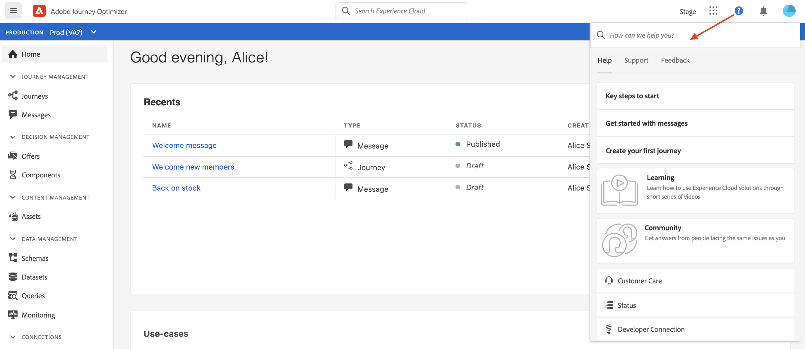
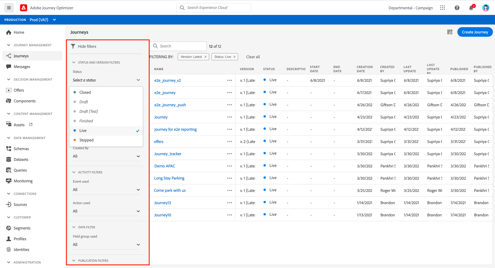
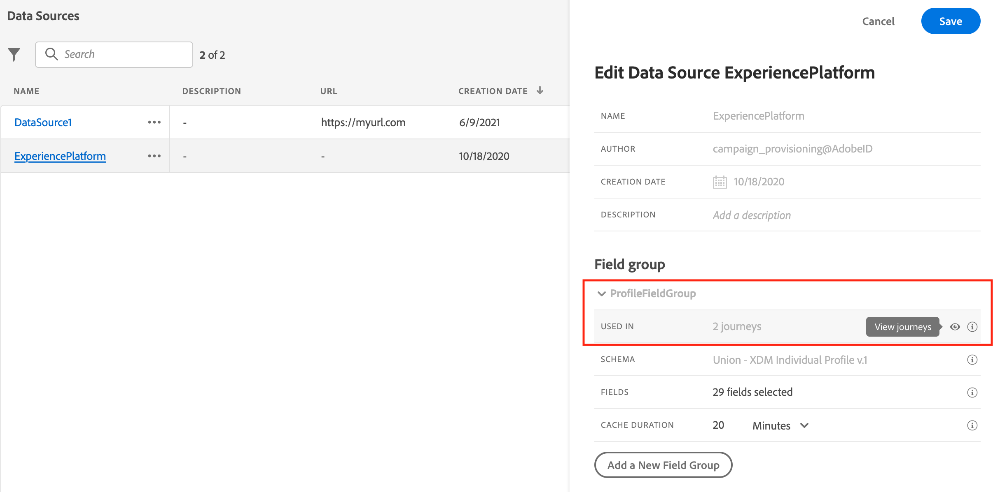

# 使用者介面 {#cjm-user-interface}

連結到 [Adobe Experience Cloud](http://experience.adobe.com) 後，導覽至 [!DNL Journey Optimizer]。

>[!NOTE]
>
>* 瀏覽使用者介面時的重要概念與 Adobe Experience Platform 相同。如需詳細資訊，請參閱[Adobe Experience Platform檔案](https://experienceleague.adobe.com/docs/experience-platform/landing/platform-ui/ui-guide.html#adobe-experience-platform-ui-guide){target=&quot;_blank&quot;}。
>
>* 本文件將經常更新，以反應此產品使用者介面的最新變更。不過，有些螢幕擷取畫面可能會與使用者介面稍有不同。
>
>* 使用者介面中可用的元件和功能取決於您的[權限](administration/permissions.md)和您的[授權套件](https://helpx.adobe.com/legal/product-descriptions/adobe-journey-optimizer.html){target=&quot;_blank&quot;}。 如有任何問題，請聯絡您的 Adobe 客戶成功經理。

## 左側導覽

使用左側的連結來瀏覽功能。

>[!NOTE]
>
>可用功能可能會視您的權限和授權合約而有所不同。

您可以在下方左側導覽中找到完整的服務和功能清單，以及相關文件的連結。

**首頁**

[!DNL Journey Optimizer] 首頁包含要啟動的主要連結和資源。**[!UICONTROL Recents]** 清單提供最近建立或更新之訊息、事件和歷程的捷徑。 此清單顯示其建立和修改日期和狀態。

**[!UICONTROL JOURNEY MANAGEMENT]**

* **[!UICONTROL Journeys]** - 建立、設定和協調客戶歷程。[了解更多](building-journeys/journey-gs.md#jo-build)

* **[!UICONTROL Messages]** - 建立、設計、測試和發佈電子郵件和推播訊息。[了解更多](create-message.md)

**[!UICONTROL DECISION MANAGEMENT]**

* **[!UICONTROL Offers]** - 從此功能表存取您最近的資源和資料集。使用此區段建立新優惠。 [了解更多](offers/offer-library/creating-personalized-offers.md)

* **[!UICONTROL Components]** - 建立位置、規則和標記。[了解更多](offers/offer-library/key-steps.md)

**[!UICONTROL CONTENT MANAGEMENT]**

* **[!UICONTROL Assets]** - [!DNL Adobe Experience Manager Assets Essentials] 為資產集中存放庫，可用來填入訊息。[了解更多](assets-essentials.md)

**[!UICONTROL DATA MANAGEMENT]**

* **[!UICONTROL Schemas]** - 使用 Adobe Experience Platform 在「方案編輯器」這個互動式視覺畫布中建立和管理體驗資料模型 (XDM) 方案。[了解更多](get-started-schemas.md)

* **[!UICONTROL Datasets]** - 所有內嵌至 Adobe Experience Platform 的資料都會以資料集的形式保留在資料湖中。資料集是資料集合的儲存和管理結構，通常是包含方案 (欄) 和欄 (列) 的表格。 [了解更多](get-started-datasets.md)

* **[!UICONTROL Queries]** - 使用 Adobe Experience Platform 查詢服務來寫入和執行查詢、檢視以前執行的查詢，以及存取由您組織內的使用者儲存的查詢。[了解更多](get-started-queries.md)

* **[!UICONTROL Monitoring]** - 使用此功能表監視 Adobe Experience Platform 使用者介面中的資料擷取。[了解更多](https://experienceleague.adobe.com/docs/experience-platform/ingestion/quality/monitor-data-ingestion.html?lang=zh-Hant){target=&quot;_blank&quot;}

**[!UICONTROL CONNECTIONS]**

* **[!UICONTROL Sources]** - 使用此功能表從多種來源 (例如 Adobe 應用程式、雲端儲存、資料庫等) 擷取資料，並建構、標示和增強傳入資料。[了解更多](get-started-sources.md)

**[!UICONTROL CUSTOMER]**

* **[!UICONTROL Segments]** - 建立和管理 Experience Platform 區段定義，並將它們運用在您的歷程中。[了解更多](segment/about-segments.md)

* **[!UICONTROL Profiles]** - 即時客戶設定檔可為個別客戶建立整體檢視，並結合來自多個管道的資料，包括線上、離線、CRM 和第三方資料。[了解更多](get-started-profiles.md)

* **[!UICONTROL Identities]** - Adobe Experience Platform 身分服務以 Adobe Experience Platform 內稱為身分圖表的方式，管理跨裝置、跨頻道及近乎即時的客戶身分識別。[了解更多](get-started-identity.md)

**[!UICONTROL ADMINISTRATION]**

* **[!UICONTROL Journey Administration]** - 使用此選單來設定 [事件](event/about-events.md)、[資料來源](datasource/about-data-sources.md)和[動作](action/action.md) ，以用於您的歷程。

* **[!UICONTROL Sandboxes]** - Adobe Experience 提供的 sandbox 可將單一執行個體分割成個別的虛擬環境，以利開發及改進數位體驗應用程式。[了解更多](administration/sandboxes.md)

<!--
* **[!UICONTROL Alerts]** - The user interface allows you to view a history of received alerts based on metrics revealed by Adobe Experience Platform Observability Insights. The UI also allows you to view, enable, and disable available alert rules. [Learn more](https://experienceleague.adobe.com/docs/experience-platform/observability/alerts/overview.html){target="_blank"}
-->

## 產品內使用案例

善用首頁的[!DNL Adobe Journey Optimizer]使用案例，並提供一些快速輸入項目以建立客戶歷程。

可用的使用案例包括：

* **建立測試設定檔**，以使用我們的 CSV 範本建立測試設定檔，以測試個人化訊息和歷程。了解如何在此頁面](building-journeys/creating-test-profiles.md#use-case-1)上實作此使用案例[。
* **傳送生日訊息給客戶**，以自動傳送電子郵件祝賀客戶生日。(即將推出)
* **傳送電子郵件給新客戶**，以輕鬆傳送最多兩封電子郵件歡迎您新註冊的客戶。(即將推出)
* **傳送推播訊息至匯入的客戶清單**，以快速將推播通知傳送至從 CSV 檔案匯入的客戶清單。(即將推出)

按一下&#x200B;**[!UICONTROL View details]**&#x200B;以進一步瞭解每個使用案例。

按一下 **[!UICONTROL Begin]** 按鈕以開始使用案例。

您可以從&#x200B;**[!UICONTROL View use case library]**&#x200B;按鈕存取已執行的使用案例。

## 協助工具{#accessibility}

[!DNL Adobe Journey Optimizer]中的協助工具功能繼承自Adobe Experience Platform:

* 鍵盤協助工具
* 顏色對比
* 驗證必填欄位

[了解更多](https://experienceleague.adobe.com/docs/experience-platform/accessibility/features.html){target=&quot;_blank&quot;}在Adobe Experience Platform檔案中。

在[!DNL Journey Optimizer]中，可以使用以下常用鍵盤快捷鍵：

| 動作 | 快速鍵 |
| --- | --- |
| 在使用者介面元素、區段和功能表群組之間移動 | 標記 |
| 在使用者介面元素、區段和功能表群組之間向後移動 | Shift + Tab |
| 在區段內移動以將焦點設定為個別元素 | 箭頭 |
| 選取或清除焦點中的元素 | 輸入或空格鍵 |
| 取消選取、折疊面板或關閉對話方塊 | Esc |

[了解更多](https://experienceleague.adobe.com/docs/experience-platform/accessibility/custom.html){target=&quot;_blank&quot;}在Adobe Experience Platform檔案中。

您可以在Journey Optimizer的特定部分使用下列捷徑：

<table>
  <thead>
    <tr>
      <th>介面元素</th>
      <th>動作</th>
      <th>快速鍵</th>
    </tr>
  </thead>
  <tr>
    <td>歷程、動作、資料來源或事件清單</td>
    <td>建立歷程、動作、資料來源或事件</td>
    <td>C</td>
  </tr>
  <tr>
    <td rowspan="3">草稿狀態的歷程畫布</td>
    <td>從左側浮動視窗的第一個可用位置（從上到下）新增活動</td>
    <td>連按兩下活動</td>
  </tr>
  <tr>
    <td>選取所有活動</td>
    <td>Ctrl + A(Windows) Command + A(Mac)</td>
  </tr>
  <tr>
    <td>刪除選取的活動</td>
    <td>刪除或退格，然後輸入以確認刪除</td>
  </tr>
  <tr>
  <td rowspan="3">

這些元素的配置窗格：

<ul>
  <li>歷程中的活動</li>
  <li>事件</li>
  <li>資料來源</li>
  <li>動作</li>
</ul>

</td>
    <td>移至下一個要設定的欄位</td>
    <td>標記</td>
  </tr>
  <tr>
    <td>儲存變更並關閉設定窗格</td>
    <td>輸入</td>
  </tr>
  <tr>
    <td>放棄更改並關閉配置窗格</td>
    <td>Esc</td>
  </tr>
  <tr>
    <td rowspan="4">在測試模式中的歷程</td>
    <td>啟用或禁用測試模式</td>
    <td>T</td>
  </tr>
  <tr>
    <td>觸發事件型歷程中的事件</td>
    <td>E</td>
  </tr>
  <tr>
    <td>

在已開啟&#x200B;**[!UICONTROL Single profile at a time]**&#x200B;選項的區段型歷程中觸發事件

</td>
    <td>P</td>
  </tr>
  <tr>
    <td>顯示測試記錄</td>
    <td>L</td>
  </tr>
<!-- //Ajouter ce raccourci quand il marchera (actuellement, le raccourci Ctrl/Cmd+F du navigateur a priorité sur celui de AJO).//
  <tr>
    <td>Page with a search bar</td>
    <td>Select the search bar</td>
    <td>Ctrl/Command + F</td>
  </tr>
-->
  <tr>
    <td>文字欄位</td>
    <td>選取所選欄位中的所有文字</td>
    <td>Ctrl + A(Windows) Command + A(Mac)</td>
  </tr>
  <tr>
    <td rowspan="2">快顯視窗</td>
    <td>儲存變更或確認動作</td>
    <td>輸入</td>
  </tr>
  <tr>
    <td>關閉視窗</td>
    <td>Esc</td>
  </tr>
  <tr>
    <td>簡單運算式編輯器</td>
    <td>選取並新增欄位</td>
    <td>按兩下欄位</td>
  </tr>
  <tr>
    <td>瀏覽XDM欄位</td>
    <td>選取節點的所有欄位</td>
    <td>選擇父節點</td>
  </tr>
  <tr>
    <td>裝載預覽</td>
    <td>選取裝載</td>
    <td>Ctrl + A(Windows) Command + A(Mac)</td>
  </tr>
</table>

## 尋找說明與支援

從首頁的下半頁面存取 Adobe Journey Optimizer 重要說明頁面。

使用&#x200B;**說明**&#x200B;圖示來存取說明頁面、聯絡支援並分享意見。 您可以從搜尋欄位搜尋說明文章和影片。

## 支援的瀏覽器

Adobe [!DNL Journey Optimizer] 介面的設計可在最新版 Google Chrome 中以最佳方式運作。 您在舊版或其他瀏覽器上使用某些功能時可能會遇到問題。

## 語言偏好設定

使用者介面目前提供下列語言版本：

* 英文
* 法文
* 德文

您的預設介面語言是由使用者設定檔中指定的偏好語言所決定。

若要變更您的語言：

* 按一下右上角頭像處的&#x200B;**「偏好設定」**。
   
* 然後按一下您電子郵件地址下方顯示的語言
* 選擇您偏好的語言，然後按一下 **「儲存」**。您可以選取第二種語言，以在您使用的元件未以您的預設語言在地化時使用。
   

## 搜尋{#unified-search}

從Adobe Journey Optimizer介面的任何位置，都可使用頂端列中央的Unified Adobe Experience Cloud搜尋功能，在沙箱中尋找資產、歷程、資料集、訊息等。

開始輸入內容以顯示排名最前的結果。輸入關鍵字的相關說明文章也會顯示在結果中。

按&#x200B;**Enter**&#x200B;訪問所有結果並按業務對象進行篩選。

## 篩選清單{#section_lgm_hpz_pgb}

在大多數清單中，搜尋列可讓您搜尋特定項目並選取篩選條件。

按一下清單左上方的篩選圖示，即可存取篩選器 。篩選功能表可讓您根據不同的條件篩選顯示的元素。您可以選擇僅顯示某一類型或狀態的元素、您建立的元素，或者在過去 30 天內修改的元素。選項會因內容而異。

在歷程清單中，您可以根據歷程的狀態、類型以及&#x200B;**[!UICONTROL Status and version filters]**&#x200B;中的版本來篩選歷程。 類型可以是：**[!UICONTROL Unitary event]**、**[!UICONTROL Segment qualification]**、**[!UICONTROL Read segment]**、**[!UICONTROL Business event]**&#x200B;或&#x200B;**[!UICONTROL Burst]**。 您可以選擇只顯示使用來自&#x200B;**[!UICONTROL Activity filters]** 與 **[!UICONTROL Data filters]**&#x200B;的特定事件、欄位群組或動作的歷程。**[!UICONTROL Publication filters]**&#x200B;可讓您選擇出版物日期或使用者。 舉例來說，您可以選擇只顯示昨天發佈之即時歷程的最新版本。[了解更多](building-journeys/using-the-journey-designer.md)。

>[!NOTE]
>
>請注意，顯示的欄可使用清單右上角的設定按鈕進行個人化。系統會為每位使用者儲存個人化設定。

使用 **[!UICONTROL Last update]** 和 **[!UICONTROL Last update by]** 欄來檢查您的歷程上次更新發生的時間以及儲存者。

在事件、資料來源和動作設定窗格中，**[!UICONTROL Used in]** 欄位會顯示使用該特定事件、欄位群組或動作的歷程次數。您可以按一下 **[!UICONTROL View journeys]** 按鈕以顯示對應歷程的清單。

在不同的清單中，您可以對每個元素執行基本動作。例如，您可以複製或刪除項目。

