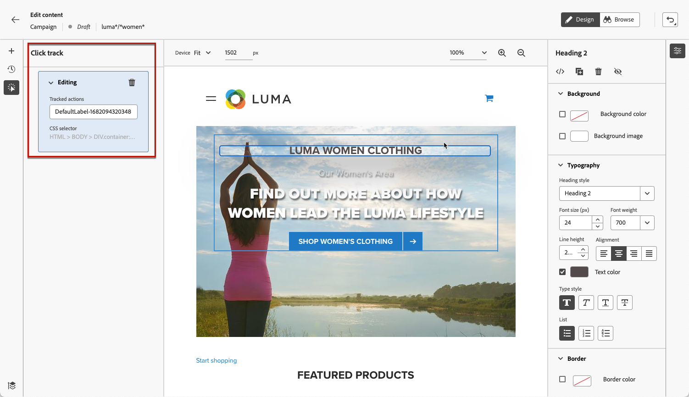

# 製作網頁 {#author-web}

一旦您 [新增網頁動作](create-web.md#create-web-campaign) 您可以使用網頁設計工具來編輯網站的內容，以執行促銷活動。

在 [!DNL Journey Optimizer]，網頁製作由 **Adobe Experience Cloud Visual Helper** chrome瀏覽器擴充功能。 [了解更多](web-prerequisites.md#visual-authoring-prerequisites)

>[!CAUTION]
>
>若要存取及編寫 [!DNL Journey Optimizer] 使用者介面，請務必遵循 [本節](web-prerequisites.md).

[了解如何透過此影片製作網頁行銷活動](#video)

## 編輯網頁內容 {#edit-web-content}

>[!CONTEXTUALHELP]
>id="ajo_web_url_to_edit_surface"
>title="確認要編輯的 URL"
>abstract="確認特定網頁的 URL，以用於編輯將套用到上面定義的網頁表面的內容。必須使用此 Adobe Experience Platform Web SDK 實作此網頁。"
>additional-url="https://experienceleague.adobe.com/docs/platform-learn/implement-web-sdk/overview.html?lang=zh-Hant" text="更多詳情"

>[!CONTEXTUALHELP]
>id="ajo_web_url_to_edit_rule"
>title="輸入要編輯的 URL"
>abstract="輸入特定網頁的 URL，以用於編輯將套用到符合規則的所有網頁的內容。必須使用 Adobe Experience Platform Web SDK 實作此網頁。"
>additional-url="https://experienceleague.adobe.com/docs/platform-learn/implement-web-sdk/overview.html?lang=zh-Hant" text="更多詳情"

若要開始編寫網頁行銷活動，請遵循下列步驟。

1. 從 **[!UICONTROL 動作]** 的 [行銷活動](create-web.md#create-web-campaign)，選取 **[!UICONTROL 編輯內容]**.<!--change screen with rule-->

   

1. 如果您建立了頁面符合規則，則必須輸入任何符合此規則的URL:變更會套用至符合規則的所有頁面。 頁面內容隨即顯示。

   >[!NOTE]
   >
   >如果您輸入單一URL作為Web表面，則已填入要個人化的URL。

   

   >[!CAUTION]
   >
   >網頁必須包含 [Adobe Experience Platform Web SDK](https://experienceleague.adobe.com/docs/platform-learn/implement-web-sdk/overview.html?lang=zh-Hant){target="_blank"}. [了解更多](web-prerequisites.md#implementation-prerequisites)

1. 按一下 **[!UICONTROL 編輯網頁]** 開始編寫。 網頁設計器隨即顯示。

   

   >[!NOTE]
   >
   >如果您嘗試載入無法載入的網站，會顯示訊息，建議您安裝 [Visual Editing Helper瀏覽器擴充功能](#install-visual-editing-helper). 請參閱 [本節](web-prerequisites.md#troubleshooting).

1. 從畫布中選取任何元素，例如影像、按鈕、段落、文字、容器、標題、連結等。 [了解更多](#content-components)

1. 使用:

   * 內容功能表，可編輯其內容、版面、插入連結或個人化等。

      

   * 右側面板上方的圖示可編輯、複製、刪除或隱藏每個元素。

      

   * 會根據所選元素動態變更的右側面板。 例如，您可以編輯元素的背景、印刷樣式、邊框、大小、位置、間距、效果或內嵌樣式。

      

>[!NOTE]
>
>網頁內容設計工具大多與電子郵件設計工具類似。 深入了解 [設計內容 [!DNL Journey Optimizer]](../email/get-started-email-design.md).

## 使用元件 {#content-components}

>[!CONTEXTUALHELP]
>id="ajo_web_designer_components"
>title="將元件新增至您的網頁"
>abstract="您可以將許多元件新增到您的網頁並根據需要進行編輯。"

1. 從 **[!UICONTROL 元件]** 窗格，選擇項目。 您可以將下列元件新增至您的網頁，並視需要加以編輯：

   * [除法器](../email/content-components.md#divider)
   * [HTML](../email/content-components.md#HTML)
   * [影像](../email/content-components.md#image)
   * 標題 — 使用此元件類似於使用 **[!UICONTROL 文字]** 元件。 [了解更多](../email/content-components.md#text)
   * 段落 — 使用此元件類似於使用 **[!UICONTROL 文字]** 元件。 [了解更多](../email/content-components.md#text)
   * 連結
   * [優惠方案決策](../email/add-offers-email.md)

   

1. 將滑鼠指標暫留在頁面中，按一下 **[!UICONTROL 插入在前]** 或 **[!UICONTROL 插入在後]** 按鈕，將元件附加至頁面上的現有元素。

   

   >[!NOTE]
   >
   >若要取消選取元件，請按一下 **[!UICONTROL ESC]** 按鈕。

1. 視需要直接在頁面內容中編輯元件。

   

1. 調整從右側內容窗格顯示的樣式，例如背景、文字顏色、邊框、大小、位置等。  — 視選取的元件而定。

   

## 新增個人化和選件

若要新增個人化，請選取容器，然後從顯示的內容功能表列中選取個人化圖示。 使用運算式編輯器新增變更。 [了解更多](../personalization/personalization-build-expressions.md)

使用 **[!UICONTROL 優惠方案決策]** 插入元件 [優惠](../offers/get-started/starting-offer-decisioning.md) 填入您的網頁。 程式與 [將優惠方案新增至電子郵件](../email/add-offers-email.md). 它將利用決策管理來挑選最適合客戶的優惠方案。

## 管理修改 {#manage-modifications}

>[!CONTEXTUALHELP]
>id="ajo_web_designer_modifications"
>title="輕鬆管理所有變更"
>abstract="使用此窗格，您可以瀏覽和管理您新增到網頁的所有調整和樣式。"

您可以輕鬆管理新增至網頁的所有元件、調整和樣式。

1. 選取 **[!UICONTROL 修改]** 表徵圖以在左側顯示相應的窗格。

   

1. 您可以檢閱您對頁面所做的每項變更。

1. 選取不需要的修改，然後按一下刪除圖示加以移除。

   

   >[!CAUTION]
   >
   >刪除動作可能會影響後續動作時，請謹慎處理。

1. 使用 **[!UICONTROL 更多動作]** 按鈕 **[!UICONTROL 修改]** 窗格來一次刪除所有修改。

   

1. 從 **[!UICONTROL 更多動作]** 功能表中，您也可以僅刪除無效的修改，這表示由其他變更覆寫的變更。 例如，如果修改文本的顏色，然後刪除該文本，則顏色修改將無效，因為該文本已不存在。

1. 您也可以使用 **[!UICONTROL 還原/重做]** 按鈕。

   

   按一下並按住按鈕，以在 **[!UICONTROL 還原]** 和 **[!UICONTROL 取消復原]** 選項。 然後按一下按鈕本身以套用所需的動作。

## 使用點擊追蹤 {#use-click-tracing}

網頁設計工具中的這項功能可讓您選取網站的任何元素，並追蹤該元素上的點按。

促銷活動上線後，您就可以檢查促銷活動網頁報表中每個元素的點按次數。 此資訊有助於改善您的網站使用者體驗。 例如，若 [網站報告](../reports/campaign-global-report.md#web-tab) 顯示有許多使用者點按了無法實際點按的元素，您可能想要新增該元素的連結。

1. 在頁面中選取元素，然後選擇 **[!UICONTROL 按一下追蹤元素]** 中取得Advertising Cloud的說明。

   

   >[!NOTE]
   >
   >可以選取任何項目，無論是否可點按。

1. 對應的追蹤動作會自動顯示在 **[!UICONTROL 按一下追蹤]** 窗格。

   

1. 新增有意義的標籤以管理所有追蹤的元素，並在報表中輕鬆尋找這些元素。 此 **[!UICONTROL CSS選取器]** 欄位會顯示尋找所選元素的資訊。

1. 重複上述步驟，選取您需要的任意其他點擊追蹤元素。 相應的操作都列在左窗格上。

   

1. 若要移除元素上的點擊追蹤，請選取對應的刪除圖示。

一旦您的促銷活動生效，您就可以檢查促銷活動報表 **[!UICONTROL Web]** 標籤來比較曝光次數、點按率和依元素的點按次數。 [了解更多](../reports/campaign-global-report.md#web-tab)

## 瀏覽網頁設計工具 {#navigate-web-designer}

### 使用階層連結 {#breadcrumbs}

1. 從畫布選取任何元素。

1. 按一下 **[!UICONTROL 展開/折疊階層連結]** 按鈕，快速顯示所選元素的相關資訊。

   

1. 當您將游標暫留在階層連結上時，編輯器中會強調顯示對應的元素。

1. 使用它，您可以輕鬆導覽至視覺編輯器中的任何父元素、同層級元素或子元素。

### 切換為瀏覽模式 {#browse-mode}

>[!CONTEXTUALHELP]
>id="ajo_web_designer_browse"
>title="使用瀏覽模式"
>abstract="在此模式下，您可以從要個人化的選取表面瀏覽到精準的頁面。"

您可以從預設值交換 **[!UICONTROL 設計]** 模式 **[!UICONTROL 瀏覽]** 模式。

從 **[!UICONTROL 瀏覽]** 模式中，您可以從要個性化的選定曲面導航到確切頁面。

在處理驗證後面的頁面，或從某個URL開始就無法使用的頁面時，它特別有用。 例如，您將能夠驗證、導覽至您的帳戶頁面或購物車頁面，然後切換回 **[!UICONTROL 設計]** 模式，以在您想要的頁面上執行變更。

### 更改設備大小 {#change-device-size}

您可以將網頁設計工具顯示的裝置大小變更為預先定義的大小，例如 **[!UICONTROL 平板電腦]** 或 **[!UICONTROL 行動橫向]**，或輸入所需的像素以定義自訂大小。

您也可以將縮放焦點從25%變更為400%。

變更裝置大小的功能是專為回應式網站而設計，這些網站在各種裝置、視窗和螢幕大小上都能正常呈現。 回應式網站會自動調整並適應任何螢幕大小，包括桌上型電腦、筆記型電腦、平板電腦或行動電話。

>[!CAUTION]
>
>您可以編輯具有特定裝置大小的網路體驗。 不過，只要選取器相同，這些變更就會套用至所有大小和裝置，而不只是您目前使用的裝置大小。 同樣地，在一般案頭檢視中編輯體驗會將變更套用至所有螢幕大小，而不只是案頭檢視。
>
>目前， [!DNL Journey Optimizer] 不支援裝置大小特定的頁面變更。 這表示，例如，如果您有獨立的行動網站具有個別的網站結構，則應在不同促銷活動中針對您的行動網站進行特定變更。

## 測試網路促銷活動 {#test-web-campaign}

>[!CONTEXTUALHELP]
>id="ajo_web_designer_preview"
>title="預覽您的網頁體驗"
>abstract="取得您的網頁體驗的模擬。"

若要顯示已修改之網路體驗的預覽，請遵循下列步驟。

>[!CAUTION]
>
>您必須有可用的測試設定檔，以模擬將會提供哪些選件給他們。 了解如何 [建立測試設定檔](../segment/creating-test-profiles.md).

1. 從網頁促銷活動編輯內容畫面中，選取 **[!UICONTROL 模擬內容]**.

   <!---->

   

1. 按一下 **[!UICONTROL 管理測試設定檔]** 來選取一或多個測試設定檔。
1. 將顯示已修改網頁的預覽。

   

1. 您也可以在預設瀏覽器中開啟測試URL，或複製測試URL以貼到任何瀏覽器中。 這可讓您與團隊和利害關係人共用連結，讓他們在促銷活動上線之前，能在任何瀏覽器中預覽新的網頁體驗。

   >[!NOTE]
   >
   >複製測試URL時，顯示的內容是針對中產生內容模擬時所使用的測試設定檔個人化的內容 [!DNL Journey Optimizer].

## 作法影片{#video}

以下影片說明如何使用 [!DNL Journey Optimizer] 行銷活動。

>[!VIDEO](https://video.tv.adobe.com/v/3418803/?quality=12&learn=on)
