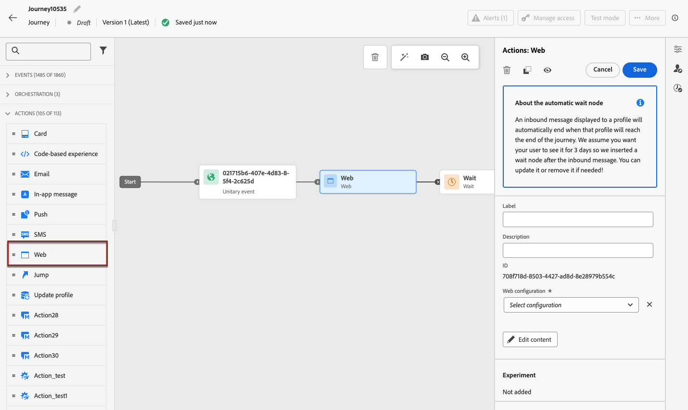
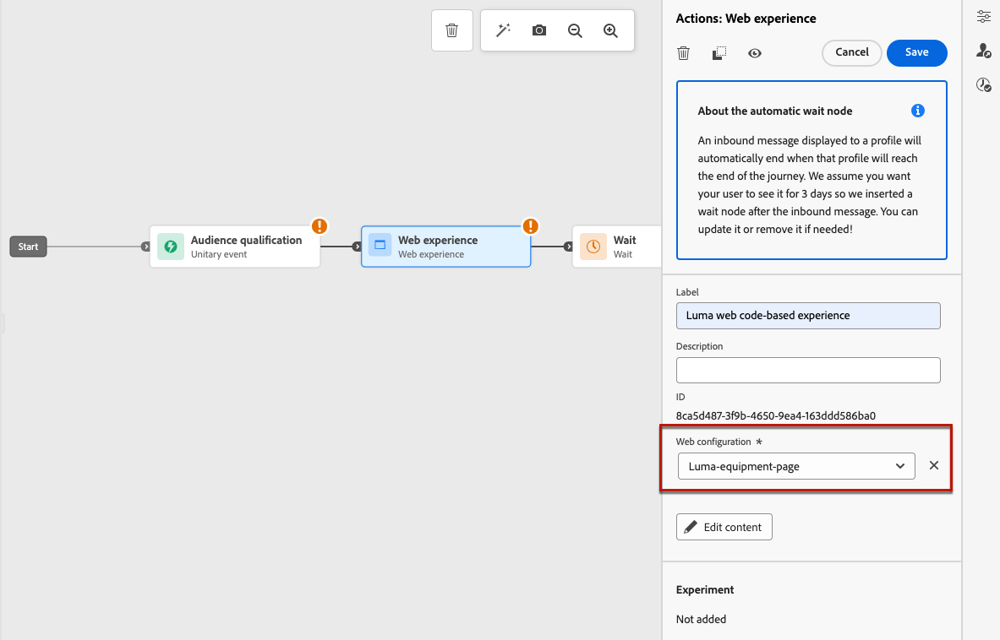
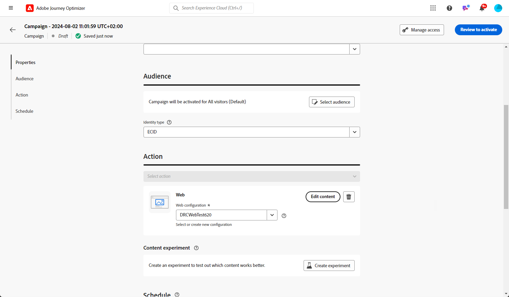
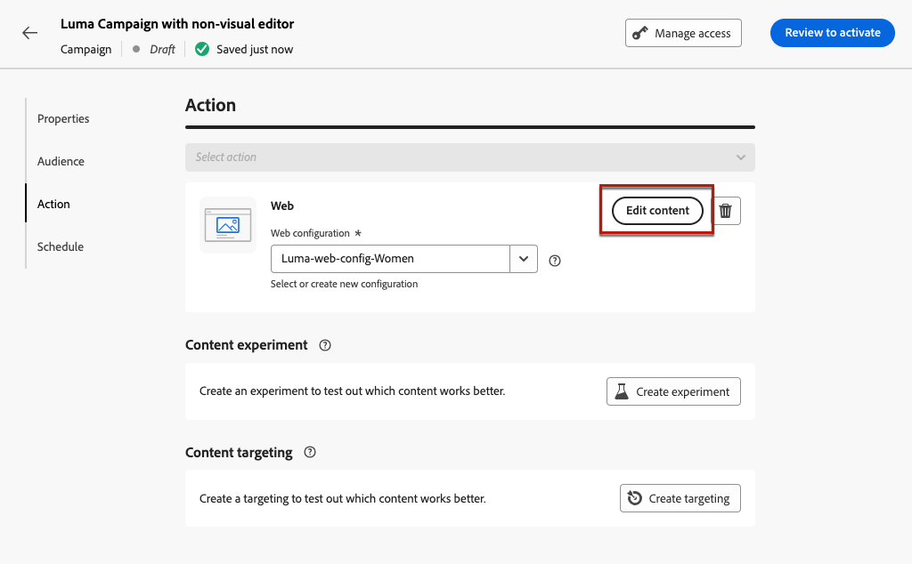
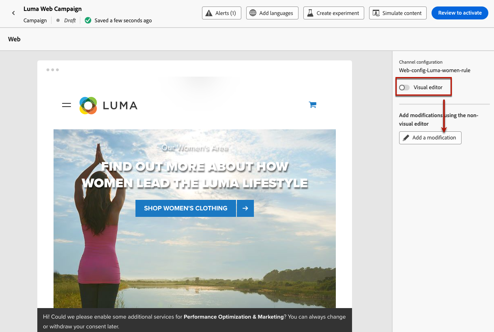
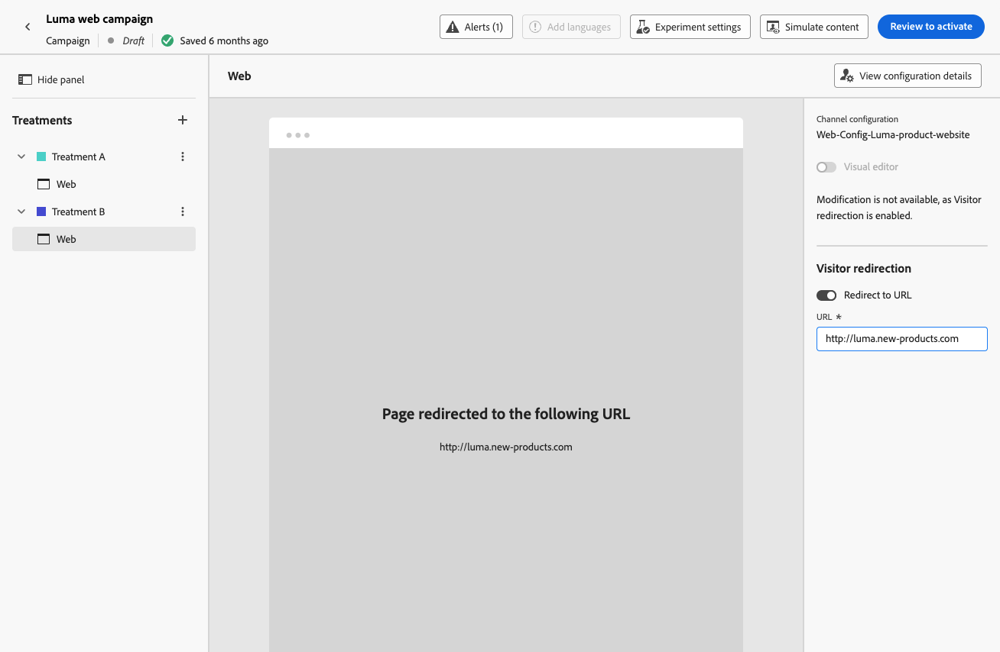
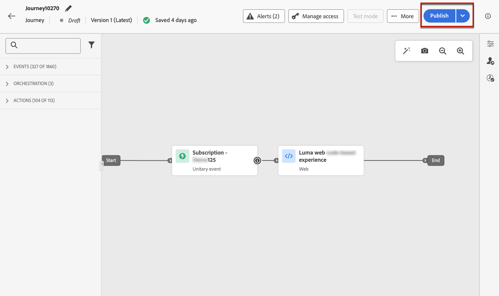

# 建立網站體驗 {#create-web}

[!DNL Journey Optimizer]可讓您個人化您透過傳入歷程或行銷活動提供給客戶的網頁體驗。

## 透過歷程或行銷活動定義網路體驗 {#create-web-experience}

>[!CONTEXTUALHELP]
>id="ajo_web_surface"
>title="定義網頁設定"
>abstract="網頁設定可能會和單頁 URL 或多個頁面相符，可讓您在一或多個網頁間傳遞內容修改。"

>[!CONTEXTUALHELP]
>id="ajo_web_surface_rule"
>title="建置頁面比對規則"
>abstract="頁面比對規則可以找出符合相同規則的多個 URL - 例如，如果您想要將變更套用到整個網站的主要橫幅，或新增顯示在網站所有產品頁面的頂端影像。"

若要透過行銷活動或歷程開始建立您的Web體驗，請遵循下列步驟。

>[!NOTE]
>
>如果這是您第一次建立網頁體驗，請務必遵循[本章節](web-prerequisites.md)所說明的先決條件。

>[!BEGINTABS]

>[!TAB 新增網站體驗至歷程]

若要將&#x200B;**Web**&#x200B;活動新增至歷程，請遵循下列步驟：

1. [建立歷程](../building-journeys/journey-gs.md)。

1. 以[事件](../building-journeys/general-events.md)或[讀取對象](../building-journeys/read-audience.md)活動來開始您的歷程。

1. 從浮動視窗的&#x200B;**[!UICONTROL 動作]**&#x200B;區段拖放&#x200B;**[!UICONTROL 網頁]**&#x200B;活動。

   

   >[!NOTE]
   >
   >由於&#x200B;**Web**&#x200B;是傳入體驗活動，因此它附帶3天&#x200B;**等待**&#x200B;活動。 [了解更多](../building-journeys/wait-activity.md#auto-wait-node)

1. 為您的訊息輸入&#x200B;**[!UICONTROL 標籤]**&#x200B;和&#x200B;**[!UICONTROL 描述]**。

1. 選取或建立要使用的[網頁組態](web-configuration.md)。

   

1. 選取&#x200B;**[!UICONTROL 編輯內容]**&#x200B;按鈕，並視需要編輯您的內容。 [了解更多](#edit-web-content)

1. 如有必要，請拖放其他動作或事件以完成您的歷程流程。 [了解更多](../building-journeys/about-journey-activities.md)

1. 在您的Web體驗準備就緒後，完成設定並發佈您的歷程以將其啟用。 [了解更多](../building-journeys/publish-journey.md)

如需如何設定歷程的詳細資訊，請參閱[此頁面](../building-journeys/journey-gs.md)。

>[!TAB 建立網路行銷活動]

若要透過行銷活動開始建立您的Web體驗，請遵循下列步驟。

1. 建立行銷活動。 [了解更多](../campaigns/create-campaign.md)

1. 選取您要執行的行銷活動型別

   * **已排程 — 行銷**：立即或在指定日期執行行銷活動。 已排程的行銷活動旨在傳送行銷訊息。 可從使用者介面設定及執行。

   * **API觸發 — 行銷/異動**：使用API呼叫執行行銷活動。 API觸發的行銷活動旨在傳送行銷或交易式訊息，也就是在個人執行動作後傳送的訊息：密碼重設、購物車購買等。 [瞭解如何使用API觸發行銷活動](../campaigns/api-triggered-campaigns.md)

1. 完成步驟以建立網路行銷活動，例如行銷活動屬性、[對象](../audience/about-audiences.md)和[排程](../campaigns/create-campaign.md#schedule)。

1. 選取&#x200B;**[!UICONTROL Web]**&#x200B;動作。

1. 選取或建立網頁組態。 [進一步瞭解Web設定](web-configuration.md)

   

1. 按一下&#x200B;**[!UICONTROL 編輯內容]**&#x200B;按鈕，視需要編輯您的內容。 [了解更多](#edit-web-content)

   <!---->

如需如何設定行銷活動的詳細資訊，請參閱[此頁面](../campaigns/get-started-with-campaigns.md)。

➡️ [在此影片中瞭解如何建立網站行銷活動](#video)

>[!ENDTABS]

## 編輯網頁內容 {#edit-web-content}

>[!CONTEXTUALHELP]
>id="ajo_web_url_to_edit_surface"
>title="確認要編輯的 URL"
>abstract="確認特定網頁的 URL，以用於編輯套用到上方定義之網頁設定的內容。必須使用此 Adobe Experience Platform Web SDK 實作此網頁。"
>additional-url="https://experienceleague.adobe.com/docs/platform-learn/implement-web-sdk/overview.html?lang=zh-Hant" text="了解更多"

>[!CONTEXTUALHELP]
>id="ajo_web_url_to_edit_rule"
>title="輸入要編輯的 URL"
>abstract="輸入特定網頁的 URL，以用於編輯將套用到符合規則的所有網頁的內容。必須使用 Adobe Experience Platform Web SDK 實作此網頁。"
>additional-url="https://experienceleague.adobe.com/docs/platform-learn/implement-web-sdk/overview.html?lang=zh-Hant" text="了解更多"

在您[將網頁動作](#create-web-experience)新增到歷程或行銷活動後，您可以使用以下其中一種方式編輯您的網站內容：

* [網頁設計工具](web-visual-editor.md)，使用視覺化編輯器創作您的體驗；
* 或[非視覺化編輯器](web-non-visual-editor.md)。

若要開始編寫您的Web體驗，請遵循下列步驟。

1. 從行銷活動的&#x200B;**[!UICONTROL 動作]**&#x200B;索引標籤或歷程中的&#x200B;**[!UICONTROL 網頁]**&#x200B;活動，選取&#x200B;**[!UICONTROL 編輯內容]**。

   

1. 版本畫面隨即顯示。 您可以：

   * 按一下&#x200B;**[!UICONTROL 編輯網頁]**&#x200B;按鈕，開始使用網頁設計工具製作您的內容以提供視覺體驗。 [了解更多](web-visual-editor.md)

     

   * 取消選取&#x200B;**[!UICONTROL 視覺化編輯器]**&#x200B;選項以改用非視覺化版本模式，然後按一下&#x200B;**[!UICONTROL 新增修改]**&#x200B;以開始編輯您的網頁內容而不載入視覺化編輯器。 [了解更多](web-non-visual-editor.md)

     

## 測試網路體驗 {#test-web-experience}

>[!CONTEXTUALHELP]
>id="ajo_web_designer_preview"
>title="預覽您的網頁體驗"
>abstract="取得您的網頁體驗的模擬。"

使用網頁設計工具[編寫您的網頁體驗](web-visual-editor.md)後，您可以使用測試設定檔來預覽您修改的網頁。 如果您已插入個人化內容，您可以使用測試設定檔資料檢查此內容的顯示方式。

若要這麼做，請從歷程或行銷活動編輯內容畫面按一下&#x200B;**[!UICONTROL 模擬內容]**，然後新增測試設定檔，以使用測試設定檔資料檢查您的網頁。

您也可以在預設瀏覽器中開啟測試網址，或複製測試URL以貼到任何瀏覽器中。 這可讓您與團隊和利害關係人共用連結，這些利害關係人將能夠在行銷活動上線之前在任何瀏覽器中預覽新的網頁體驗。

>[!NOTE]
>
>複製測試URL時，顯示的內容是在[!DNL Journey Optimizer]中產生內容模擬時所使用之測試設定檔的個人化內容。

有關如何選取測試設定檔及預覽內容的詳細資訊，請參閱[內容管理](../content-management/preview-test.md)區段。

## 重新導向至 URL {#web-redirect-to-url}

>[!CONTEXTUALHELP]
>id="ajo_web_designer_redirect"
>title="重新導向至其他 URL"
>abstract="請輸入您想要重新導向頁面訪客的現有 URL"

建立Web體驗時，您可以將訪客重新導向至另一個現有URL，而不是在Web設計工具中編寫新的變數。

使用此容量，您可以執行比較兩個不同體驗的[內容實驗](../content-management/content-experiment.md)，而不只是變更頁面中的幾個元素。

例如，建立具有兩種處理的網路行銷活動：

* 在&#x200B;**處理A**&#x200B;中，使用網頁設計工具為一半目標母體編寫網頁體驗。

* 在&#x200B;**處理B**&#x200B;中，選取目標母體其他一半的&#x200B;**[!UICONTROL 重新導向至URL]**&#x200B;選項。 輸入您於[!DNL Journey Optimizer]之外編寫之替代設計的頁面URL。

  

  >[!NOTE]
  >
  >網站預覽不再顯示，**[!UICONTROL 視覺化編輯器]**&#x200B;切換按鈕已停用。

一旦您的網頁行銷活動上線，您就可以追蹤您在[!DNL Journey Optimizer]中編寫的網頁體驗針對重新導向至外部登陸頁面之訪客的執行情形。 瞭解如何使用[實驗性行銷活動報告](../reports/campaign-global-report-cja-experimentation.md)

## 讓您的網頁體驗上線 {#web-experience-live}

>[!IMPORTANT]
>
> 如果您的行銷活動受核准原則的約束，您將需要請求核准才能啟用您的網站體驗。 [了解更多](../test-approve/gs-approval.md)

定義網頁體驗並視需要編輯內容後，您就可以啟用歷程或行銷活動，讓您的變更對對象可見。

您也可以在讓網頁體驗內容上線之前，先預覽該內容。 [了解更多](#test-web-experience)

>[!NOTE]
>
>如果您啟用一個影響相同頁面的網頁歷程或行銷活動，做為另一個已上線的歷程或行銷活動，則所有變更將會套用至您的網頁。
>
>如果有多個歷程或行銷活動更新網站的相同元素，則會以最高優先順序的歷程/行銷活動優先。

### 發佈網站歷程 {#activate-web-journey}

若要讓您的網頁體驗透過歷程上線，請遵循下列步驟。

1. 確認您的歷程有效且沒有錯誤。 [了解更多](../building-journeys/troubleshooting.md#activity-errors)

1. 在歷程中，選取位於右上角下拉式功能表中的&#x200B;**[!UICONTROL 發佈]**&#x200B;選項。

   

   >[!NOTE]
   >
   >在[本節](../building-journeys/publish-journey.md)中進一步瞭解發佈歷程。

您的網路歷程會採用&#x200B;**[!UICONTROL 即時]**&#x200B;狀態，且現在為唯讀。 您歷程的每個收件者都能看到您新增至網站的修改專案。

>[!NOTE]
>
>按一下&#x200B;**[!UICONTROL 發佈]**&#x200B;之後，最多可能需要15分鐘的時間才能讓變更在您的網站上上線。

### 啟動網站行銷活動 {#activate-web-campaign}

定義網路行銷活動設定並視需要編輯內容後，您就可以檢閱並啟用網路行銷活動。 請遵循下列步驟。

1. 從您的網路行銷活動中，選取&#x200B;**[!UICONTROL 檢閱以啟動]**。

1. 視需要檢查並編輯內容、屬性、設定、對象和排程。

1. 選取&#x200B;**[!UICONTROL 啟動]**。

   

   >[!NOTE]
   >
   >在[本節](../campaigns/review-activate-campaign.md)中進一步瞭解啟用行銷活動。

您的網路行銷活動會採用&#x200B;**[!UICONTROL 即時]**&#x200B;狀態，現在選定的對象可以看到。 行銷活動的每位收件者都能看到您新增至網站的修改內容。

>[!NOTE]
>
>按一下&#x200B;**[!UICONTROL 啟用]**&#x200B;後，最多可能需要15分鐘的時間才能讓網站上的網路行銷活動變更上線。
>
>如果您為網路行銷活動定義排程，在到達開始日期和時間之前，其狀態為&#x200B;**[!UICONTROL 已排程]**。

一旦您的體驗上線，您就可以監視您的網路歷程和行銷活動。 [了解更多](monitor-web-experiences.md)

## 停止網站歷程或行銷活動 {#stop-web-experience}

當網站歷程或行銷活動上線時，您可以停止它以防止您的對象看到您的修改。 請遵循下列步驟。

1. 從個別清單中選取即時歷程或行銷活動。

1. 根據您的情況執行相關動作：

   * 從行銷活動頂端功能表，選取&#x200B;**[!UICONTROL 停止行銷活動]**。

     

   * 從歷程頂端功能表，按一下&#x200B;**[!UICONTROL 更多]**&#x200B;按鈕，然後選取&#x200B;**[!UICONTROL 停止]**。

     

1. 您所定義的對象看不見您新增的修改。

>[!NOTE]
>
>一旦網站歷程或行銷活動停止，您就無法再次編輯或啟動它。 您只能複製它並啟動複製的歷程/行銷活動。

## 作法影片{#video}

以下影片說明如何建立網站行銷活動、設定其屬性、檢閱及發佈。

>[!VIDEO](https://video.tv.adobe.com/v/3449992/?captions=chi_hant&quality=12&learn=on)