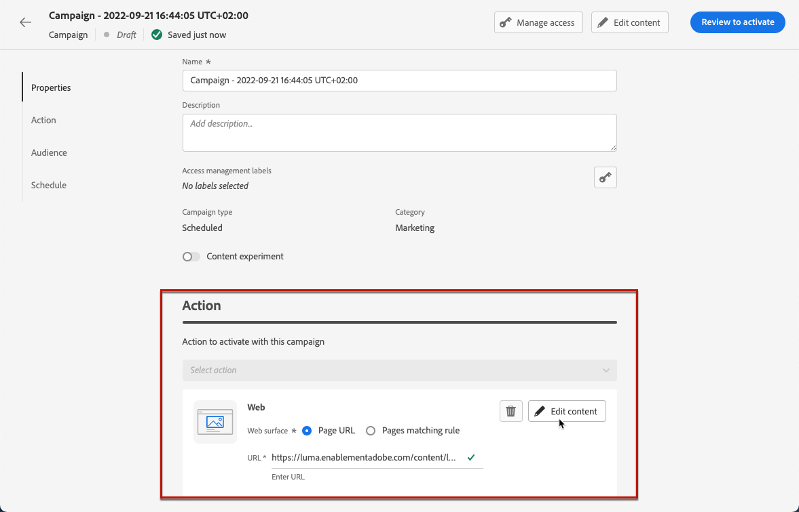

# 建立網路體驗 {#create-web}

>[!AVAILABILITY]
>
>網路頻道功能目前僅供選取使用者的測試版使用。

[!DNL Journey Optimizer] 可讓您透過傳入的網頁行銷活動，個人化您提供給客戶的網頁體驗。

>[!CAUTION]
>
>目前在 [!DNL Journey Optimizer] 您只能使用 **行銷活動**.

## 先決條件 {#prerequesites}

若要存取及編寫 [!DNL Journey Optimizer] 使用者介面，請遵循下列必要條件：

* 若要新增修改至您的網站，您必須實作 [Adobe Experience Platform Web SDK](https://experienceleague.adobe.com/docs/platform-learn/implement-web-sdk/overview.html?lang=zh-Hant){target=&quot;_blank&quot;}。

* 若要存取 [!DNL Journey Optimizer] 網頁設計工具，您必須下載 [Adobe Experience Cloud Visual Editing Helper](https://chrome.google.com/webstore/detail/adobe-experience-cloud-vi/kgmjjkfjacffaebgpkpcllakjifppnca)Chrome上的{target=&quot;_blank&quot;}瀏覽器擴充功能。 [了解更多](visual-editing-helper.md)

>[!CAUTION]
>
>Google Chrome目前是唯一支援在 [!DNL Journey Optimizer].

為了正確傳送網頁體驗，必須定義下列設定：

* 在 [Adobe Experience Platform資料收集](https://experienceleague.adobe.com/docs/experience-platform/edge/datastreams/overview.html){target=&quot;_blank&quot;}，請確定您有定義為的資料流，例如 **[!UICONTROL Adobe Experience Platform]** 服務 **[!UICONTROL 邊緣分割]** 和 **[!UICONTROL Adobe Journey Optimizer]** 選項。 這可確保Journey Optimizer入站事件由Adobe Experience Platform Edge正確處理。 [了解更多](https://experienceleague.adobe.com/docs/experience-platform/edge/datastreams/configure.html){target=&quot;_blank&quot;}

   

   >[!NOTE]
   >
   >此 **[!UICONTROL Adobe Journey Optimizer]** 選項僅可在 **[!UICONTROL 邊緣分割]** 選項。

* 在 [Adobe Experience Platform](https://experienceleague.adobe.com/docs/experience-platform/profile/home.html?lang=zh-Hant){target=&quot;_blank&quot;}，請確定您有一個合併原則與 **[!UICONTROL 邊緣活動合併策略]** 選項啟用。 要執行此操作，請在 **[!UICONTROL 客戶]** > **[!UICONTROL 設定檔]** > **[!UICONTROL 合併策略]** Experience Platform功能表。 [了解更多](https://experienceleague.adobe.com/docs/experience-platform/profile/merge-policies/ui-guide.html#configure){target=&quot;_blank&quot;}

   

## 建立網路行銷活動 {#create-web-campaign}

若要開始透過促銷活動建立您的網頁體驗，請遵循下列步驟。

1. 建立行銷活動. [了解更多](../campaigns/create-campaign.md)

1. 選取 **[!UICONTROL Web]** 動作。

   

1. 定義網面。

   >[!NOTE]
   >
   >Web表面是由要傳送內容的URL所識別的Web屬性。 它可以比對單一頁面URL或多個頁面，讓您可以在一或多個網頁間提供修改。

   您可以輸入 **[!UICONTROL 頁面URL]** 如果您只想將變更套用至單一頁面。

   

1. 或者，您可以建置 **[!UICONTROL 頁面符合規則]** 若要鎖定符合相同規則的多個URL，例如，如果您想要將變更套用至整個網站的主圖橫幅，或新增顯示在網站所有產品頁面上的最上層影像。

   若要這麼做，請選取 **[!UICONTROL 頁面符合規則]** 按一下 **[!UICONTROL 建立規則]**.

   

1. 定義 **[!UICONTROL 網域]** 和 **[!UICONTROL 頁面]** 欄位。

   例如，如果您想要編輯Luma網站上所有女性產品頁面上顯示的元素，請選取 **[!UICONTROL 網域]** > **[!UICONTROL 開頭為]** > `luma` 和 **[!UICONTROL 頁面]** > **[!UICONTROL 包含]** > `women`.

   

1. 儲存您的變更。規則會顯示在 **[!UICONTROL 建立行銷活動]** 螢幕。

   

1. 定義網格曲面後，選取 **[!UICONTROL 建立]**. 您現在可以配置促銷活動屬性和設定。

## 設定Web促銷活動 {#configure-web-campaign}

1. 在 **[!UICONTROL 屬性]** 標籤，您可以編輯促銷活動名稱，並視需要新增說明。

   

1. 若要將自訂或核心資料使用量標籤指派給Web促銷活動，請選取 **[!UICONTROL 管理存取]** 按鈕。 [進一步了解物件層級存取控制(OLAC)](../administration/object-based-access.md)

1. 您可以選取 **[!UICONTROL 內容實驗]** 測試部分受眾的內容處理，以決定哪個處理相對於特定量度執行效果最佳。 [了解更多](../campaigns/content-experiment.md)

   >[!AVAILABILITY]
   >
   >此 **內容實驗** 功能目前僅適用於一組組織（有限可用性）。 如需詳細資訊，請聯絡您的 Adobe 代表。

1. 從 **[!UICONTROL 動作]** 選取 **[!UICONTROL 編輯內容]** 開始編寫網頁行銷活動。 [了解更多](author-web.md)

   

1. 從 **[!UICONTROL 對象]** 索引標籤，定義將能查看您網頁行銷活動的人員。 依預設，所有訪客都可看到網頁促銷活動。

   

   您也可以選取特定對象。 使用 **[!UICONTROL 選取對象]** 按鈕以顯示可用的Adobe Experience Platform區段清單。 [深入了解區段](../segment/about-segments.md)

   >[!NOTE]
   >
   >針對API觸發的促銷活動，對象必須透過API呼叫來設定。 [了解更多](../campaigns/api-triggered-campaigns.md)

   

1. 在 **[!UICONTROL 身分命名空間]** 欄位中，選擇要使用的命名空間，以識別所選區段中的個人。 [進一步了解命名空間](../event/about-creating.md#select-the-namespace)

1. 定義 **[!UICONTROL 排程]** 的ID服務。 [了解更多](../campaigns/create-campaign.md#schedule)

   

   依預設，它會在手動啟動時開始，並在手動停止時結束，但您也可以定義特定日期和時間，讓修改可見。

   

## 啟動網路行銷活動 {#activate-web-campaign}

在您定義 [網站行銷活動設定](#configure-web-campaign) 而且您可以視需要使用 [網頁設計工具](author-web.md)，您可以檢閱並啟動您的網頁行銷活動。 請遵循下列步驟。

>[!NOTE]
>
>您也可以先預覽網頁行銷活動內容，再加以啟用。 [了解更多](author-web.md#test-web-campaign)

1. 從您的網路行銷活動中，選取 **[!UICONTROL 審核以激活]**.

   

1. 視需要檢閱和編輯內容、屬性、表面、對象和排程。

1. 選擇 **[!UICONTROL 啟動]**.

   

   >[!NOTE]
   >
   >按一下 **[!UICONTROL 啟動]**，則網站上最多可能需要15分鐘才會上線提供網頁促銷活動變更。

您的網路行銷活動會 **[!UICONTROL 即時]** 狀態和現在會顯示給選取的對象。 行銷活動的每個收件者都可以透過 [!DNL Journey Optimizer] 網頁設計工具。

>[!NOTE]
>
>如果您定義了Web促銷活動的排程，則其具有 **[!UICONTROL 已排程]** 狀態直到達到開始日期和時間為止。
>
>如果您啟用的網頁促銷活動與另一個已上線的促銷活動影響相同的頁面，所有變更都會套用至您的網頁。

進一步了解如何在 [本節](../campaigns/review-activate-campaign.md).

## 停止網路行銷活動 {#stop-web-campaign}

當網頁行銷活動上線時，您可以停止行銷活動，以防止對象看到您的修改。 請遵循下列步驟。

1. 從清單中選取已上線的促銷活動。

1. 從頂端功能表中，選取 **[!UICONTROL 停止促銷活動]**.

   

1. 您新增的修改將不再對您定義的對象顯示。

>[!NOTE]
>
>一旦停止Web促銷活動，您就無法再次編輯或啟動它。 您只能複製它並啟動複製的促銷活動。