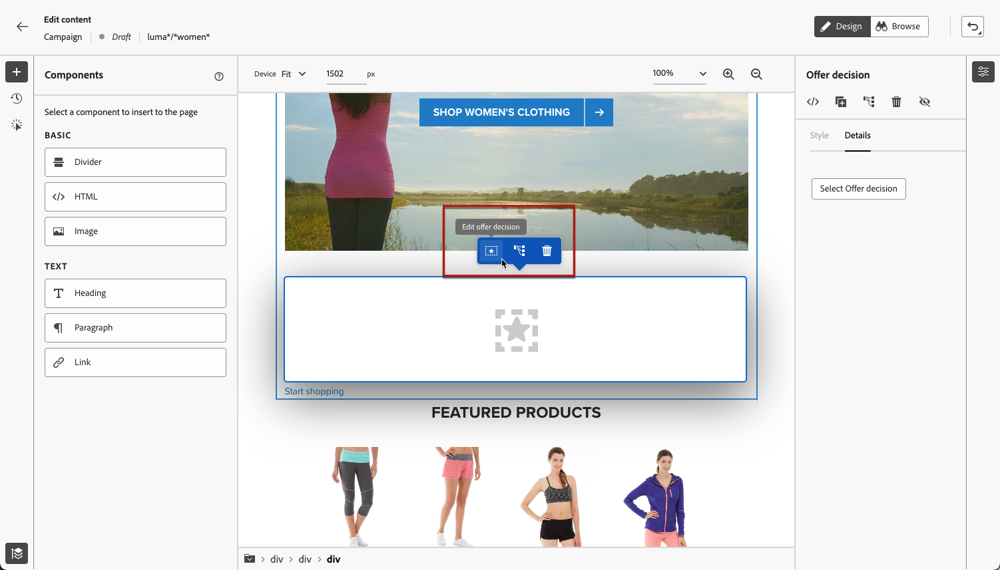

# 編輯網頁內容 {#edit-web-content}

一旦您 [已新增網頁動作](create-web.md#create-web-campaign) 對於您的行銷活動，您可以使用網頁設計工具編輯網站內容。

[透過此影片瞭解如何創作網路行銷活動](#video)

在 [!DNL Journey Optimizer]，網頁製作由以下提供技術支援： **Adobe Experience Cloud Visual Helper** chrome瀏覽器擴充功能。 [了解更多](web-prerequisites.md#visual-authoring-prerequisites)

>[!CAUTION]
>
>若要能夠存取及編寫中的網頁 [!DNL Journey Optimizer] 使用者介面，請務必遵循中列出的先決條件 [本節](web-prerequisites.md).

存取下列章節以深入瞭解每個主題：

* [管理修改](manage-web-modifications.md)

* [監視網路行銷活動](monitor-web-campaigns.md)

## 使用網頁設計工具 {#work-with-web-designer}

>[!CONTEXTUALHELP]
>id="ajo_web_url_to_edit_surface"
>title="確認要編輯的 URL"
>abstract="確認特定網頁的 URL，以用於編輯將套用到上面定義的網頁表面的內容。必須使用此 Adobe Experience Platform Web SDK 實作此網頁。"
>additional-url="https://experienceleague.adobe.com/docs/platform-learn/implement-web-sdk/overview.html?lang=zh-Hant" text="更多詳情"

>[!CONTEXTUALHELP]
>id="ajo_web_url_to_edit_rule"
>title="輸入要編輯的 URL"
>abstract="輸入特定網頁的 URL，以用於編輯將套用到符合規則的所有網頁的內容。必須使用 Adobe Experience Platform Web SDK 實作此網頁。"
>additional-url="https://experienceleague.adobe.com/docs/platform-learn/implement-web-sdk/overview.html?lang=zh-Hant" text="更多詳情"

若要開始撰寫網頁行銷活動，請遵循下列步驟。

1. 從 **[!UICONTROL 動作]** 的標籤 [行銷活動](create-web.md#create-web-campaign)，選取 **[!UICONTROL 編輯內容]**.<!--change screen with rule-->

   

1. 如果您已建立符合規則的頁面，則必須輸入符合此規則的任何URL：變更將套用至符合規則的所有頁面。 頁面內容隨即顯示。

   >[!NOTE]
   >
   >如果您輸入單一URL作為網頁表面，則會填入要個人化的URL。

   

   >[!CAUTION]
   >
   >網頁必須包含 [Adobe Experience Platform Web SDK](https://experienceleague.adobe.com/docs/platform-learn/implement-web-sdk/overview.html?lang=zh-Hant){target="_blank"}. [了解更多](web-prerequisites.md#implementation-prerequisites)

1. 按一下 **[!UICONTROL 編輯網頁]** 以開始編寫。 網頁設計工具隨即顯示。

   

   >[!NOTE]
   >
   >如果您嘗試載入無法載入的網站，則會顯示一則訊息，建議您安裝 [Visual Editing Helper瀏覽器擴充功能](#install-visual-editing-helper). 請參閱中疑難排解的一些提示 [本節](web-prerequisites.md#troubleshooting).

1. 從畫布中選取任何元素，例如影像、按鈕、段落、文字、容器、標題、連結等。 [了解更多](#content-components)

1. 使用:

   * 上下文選單可編輯其內容、配置、插入連結或個人化等。

     

   * 右側面板頂端的圖示可編輯、複製、刪除或隱藏每個元素。

     

   * 根據所選元素動態變更的右側面板。 例如，您可以編輯元素的背景、印刷樣式、框線、大小、位置、間距、效果或內嵌樣式。

     

>[!NOTE]
>
>網頁內容設計工具通常與電子郵件設計工具類似。 進一步瞭解 [設計內容，使用 [!DNL Journey Optimizer]](../email/get-started-email-design.md).

## 使用元件 {#content-components}

>[!CONTEXTUALHELP]
>id="ajo_web_designer_components"
>title="將元件新增到您的網頁"
>abstract="您可以將許多元件新增到您的網頁並根據需要進行編輯。"

1. 從 **[!UICONTROL 元件]** 窗格，選取專案。 您可以將下列元件新增至網頁，並視需要加以編輯：

   * [分隔線](../email/content-components.md#divider)
   * [HTML](../email/content-components.md#HTML)
   * [影像](../email/content-components.md#image)
   * 標題 — 使用此元件與使用 **[!UICONTROL 文字]** 電子郵件設計工具中的元件。 [了解更多](../email/content-components.md#text)
   * 段落 — 使用此元件與使用 **[!UICONTROL 文字]** 電子郵件設計工具中的元件。 [了解更多](../email/content-components.md#text)
   * 連結
   * [優惠決定](../email/add-offers-email.md)

   

1. 將滑鼠指標暫留在頁面上，然後按一下 **[!UICONTROL 插入在前]** 或 **[!UICONTROL 插入在後]** 按鈕以將元件附加至頁面上的現有元素。

   

   >[!NOTE]
   >
   >若要取消選取元件，請按一下 **[!UICONTROL ESC]** 在畫布上方顯示的內容藍色橫幅中的按鈕。

1. 視需要直接在頁面的內容中編輯元件。

   

1. 調整從右邊內容窗格顯示的樣式，例如背景、文字顏色、邊框、大小、位置等。  — 視選取的元件而定。

   

## 新增個人化和優惠方案

若要新增個人化，請選取容器，然後從顯示的內容功能表列中選取個人化圖示。 使用運算式編輯器新增變更。 [了解更多](../personalization/personalization-build-expressions.md)

使用 **[!UICONTROL 優惠決定]** 要插入的元件 [優惠方案](../offers/get-started/starting-offer-decisioning.md) 放到您的網頁中。 程式與以下情況相同： [將優惠方案新增至電子郵件](../email/add-offers-email.md). 它會運用決策管理，挑選要提供給客戶的最佳優惠方案。

## 瀏覽網頁設計工具 {#navigate-web-designer}

本節詳細說明您可以瀏覽Web設計工具的各種方式。 若要檢視及管理新增至您網站體驗的修改，請參閱 [本節](manage-web-modifications.md).

### 使用階層連結 {#breadcrumbs}

1. 從畫布中選取任何元素。

1. 按一下 **[!UICONTROL 展開/摺疊階層連結]** 按鈕來快速顯示有關所選元素的資訊。

   

1. 當您將游標停留在階層連結上時，編輯器中會反白顯示對應的元素。

1. 您可以使用它輕鬆導覽至視覺編輯器中的任何父項、同層級專案或子項元素。

### 切換至瀏覽模式 {#browse-mode}

>[!CONTEXTUALHELP]
>id="ajo_web_designer_browse"
>title="使用瀏覽模式"
>abstract="在此模式下，您可以從要個人化的選取表面瀏覽到精準的頁面。"

您可以從預設值交換 **[!UICONTROL 設計]** 模式切換為 **[!UICONTROL 瀏覽]** 模式使用「專用」按鈕。

從 **[!UICONTROL 瀏覽]** 模式，您可以導覽至您要個人化之所選表面的確切頁面。

在處理經過驗證或無法從特定URL開始使用的頁面時，此外掛程式特別有用。 例如，您將能夠驗證、導覽至您的帳戶頁面或購物車頁面，然後切換回 **[!UICONTROL 設計]** 模式，以在您所需的頁面上執行變更。

使用 **[!UICONTROL 瀏覽]** 模式也可讓您在製作單頁應用程式時瀏覽網站的所有檢視。 [了解更多](web-spa.md)

### 變更裝置大小 {#change-device-size}

您可以將網頁設計工具顯示的裝置大小變更為預先定義的大小，例如 **[!UICONTROL 平板電腦]** 或 **[!UICONTROL 行動裝置橫向]**，或輸入所需畫素數來定義自訂大小。

您也可以將縮放焦點從25%變更為400%。

變更裝置大小的功能是專為可適當呈現在各種裝置、視窗和熒幕大小的回應式網站所設計。 回應式網站會自動調整並適應任何螢幕大小，包括桌上型電腦、筆記型電腦、平板電腦或行動電話。

>[!CAUTION]
>
>您可以編輯具有特定裝置大小的網頁體驗。 不過，只要選取器相同，這些變更就會套用至所有大小和裝置，而不只是您正在使用的裝置大小。 同樣地，在標準案頭檢視中編輯體驗時，會將變更套用至所有熒幕大小，而不僅僅是案頭檢視。
>
>目前， [!DNL Journey Optimizer] 不支援裝置大小特定的頁面變更。 這表示，舉例來說，如果您有另一個行動網站具有不同的網站結構，您應該針對不同促銷活動中的行動網站進行特定變更。

## 操作說明影片{#video}

以下影片說明如何在中使用網頁設計工具製作網頁體驗 [!DNL Journey Optimizer] 行銷活動。

>[!VIDEO](https://video.tv.adobe.com/v/3418803/?quality=12&learn=on)