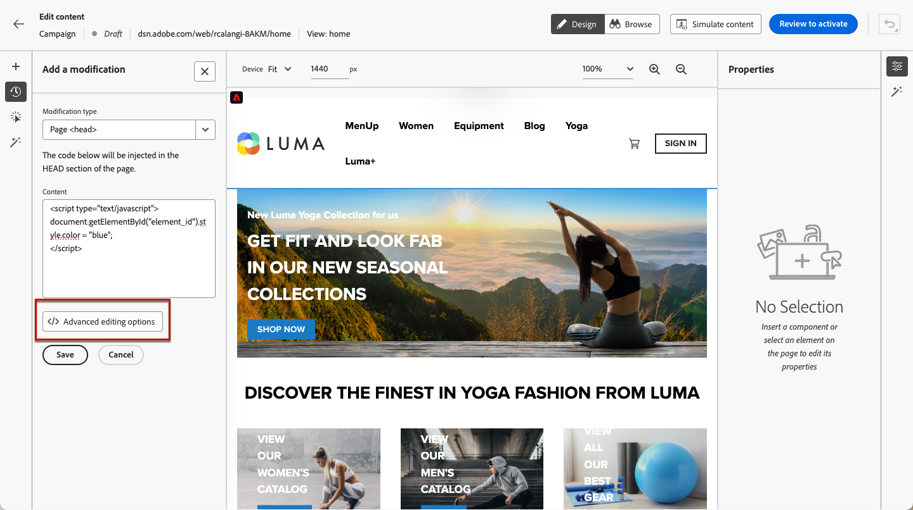

# 管理網頁修改 {#manage-web-modifications}

>[!CONTEXTUALHELP]
>id="ajo_web_designer_modifications"
>title="輕鬆管理所有變更"
>abstract="使用此窗格，您可以瀏覽和管理您新增到網頁的所有調整和樣式。"

您可以輕鬆管理新增至網頁的所有元件、調整和樣式。 您也可以直接從專用窗格新增修改。

## 使用修改窗格 {#use-modifications-pane}

1. 選取&#x200B;**[!UICONTROL 修改]**&#x200B;圖示以在左側顯示對應的窗格。

   

1. 您可以檢閱對頁面所做的每項變更。

1. 選取不想要的修改，然後從&#x200B;**[!UICONTROL 更多動作]**&#x200B;按鈕按一下&#x200B;**[!UICONTROL 刪除修改]**&#x200B;選項以移除它。

   

   >[!CAUTION]
   >
   >刪除動作時請務必謹慎，因為動作可能會影響後續動作。

1. 如果您正在編寫[單頁應用程式](web-spa.md)，您可以將任何修改套用至其他檢視。 [了解更多](web-spa.md#apply-modifications-views)

1. 若要同時刪除多個修改，請按一下&#x200B;**[!UICONTROL 修改]**&#x200B;窗格上方的&#x200B;**[!UICONTROL 選取]**&#x200B;按鈕，檢查您選擇的修改，然後按一下&#x200B;**[!UICONTROL 刪除]**&#x200B;圖示。

   

1. 使用&#x200B;**[!UICONTROL 修改]**&#x200B;窗格上方的&#x200B;**[!UICONTROL 更多動作]**&#x200B;按鈕，一次刪除所有修改。

   

1. 您也可以僅刪除無效的修改，亦即其他變更已覆寫這些變更。 例如，如果您修改文字的顏色，然後刪除該文字，則顏色修改會變成無效，因為該文字已不存在。

1. 您可以使用畫面右上方的&#x200B;**[!UICONTROL 復原/重做]**&#x200B;按鈕來取消和重做動作。

   

   按住按鈕以在&#x200B;**[!UICONTROL 復原]**&#x200B;和&#x200B;**[!UICONTROL 取消復原]**&#x200B;選項之間切換。 然後按一下按鈕本身，套用所需的動作。

## 從專用窗格新增修改 {#add-modifications}

使用網頁設計工具編輯頁面時，您可以直接從&#x200B;**[!UICONTROL 修改]**&#x200B;窗格新增內容變更，而不需要從網頁設計工具介面選取元件並加以編輯。 請遵循下列步驟。

1. 在&#x200B;**[!UICONTROL 修改]**&#x200B;窗格中，按一下&#x200B;**[!UICONTROL 更多動作]**&#x200B;按鈕。

1. 選取&#x200B;**[!UICONTROL 新增修改]**。

   

1. 選取修改型別：

   * **[!UICONTROL CSS選擇器]** - [深入瞭解](#css-selector)
   * **[!UICONTROL 頁面`<Head>`]** - [深入瞭解](#page-head)

1. 輸入您的內容並&#x200B;**[!UICONTROL 儲存]**&#x200B;您的變更。

1. 按一下您修改旁的&#x200B;**[!UICONTROL 更多動作]**&#x200B;按鈕，並選取&#x200B;**[!UICONTROL 資訊]**&#x200B;以顯示其詳細資料。

   

### CSS選取器 {#css-selector}

若要新增&#x200B;**CSS選取器**&#x200B;型別修改，請遵循下列步驟。

1. 選取&#x200B;**[!UICONTROL CSS選取器]**&#x200B;作為修改型別。

1. **[!UICONTROL CSS元素選取器]**&#x200B;欄位可協助您尋找並選取要套用變更的HTML元素（或DOM樹狀結構中的節點）。<!--specify the desired CSS element that you want to modify.-->

   

1. 選取動作型別（**[!UICONTROL 設定內容]**&#x200B;或&#x200B;**[!UICONTROL 設定屬性]**）並填入必要的資訊/內容。

   * **[!UICONTROL 設定內容]**：指定進入&#x200B;**[!UICONTROL CSS元素選取器]**&#x200B;欄位所識別之元素的內容。

   * **[!UICONTROL 設定屬性]**：指定要與目前CSS選取器關聯的屬性，以便這個選取器也能由這個屬性識別。 若要這麼做，請在&#x200B;**[!UICONTROL 屬性名稱]**&#x200B;欄位中輸入名稱，並在&#x200B;**[!UICONTROL 內容]**&#x200B;欄位中輸入值。 如果屬性已經存在，則會更新值；否則，會以指定的名稱和值新增屬性。

     

### 頁面 `<head>` {#page-head}

>[!CONTEXTUALHELP]
>id="ajo_web_designer_head"
>title="新增自訂程式碼"
>abstract="HEAD 元素是中繼資料的容器，位於 HTML 標記和 BODY 標記之間。僅新增 SCRIPT 和 STYLE 元素。新增 DIV 標記和其他元素可能會造成其餘的 HEAD 元素出現在 BODY 中。"

您可以使用&#x200B;**[!UICONTROL 頁面`<head>`]**&#x200B;修改型別來新增自訂程式碼。

`<head>`元素是中繼資料（資料的相關資料）的容器，並置於`<html>`標籤和`<body>`標籤之間。 在此情況下，程式碼不會等待內文或頁面載入事件，而是在頁面載入開始時執行。

`<head>`元素通常用於將JavaScript或CSS程式碼新增至頁面頂端。 後續視覺化動作的選取器取決於此標籤中新增的HTML元素。

若要新增&#x200B;**頁面`<head>`**&#x200B;型別修改，請遵循下列步驟。

1. 選取&#x200B;**[!UICONTROL 頁面`<head>`]**&#x200B;作為修改型別。

   

1. 在&#x200B;**[!UICONTROL 內容]**&#x200B;方塊中新增您的自訂程式碼。

   >[!CAUTION]
   >
   >您只能新增`<script>`和`<style>`專案至`<head>`區段。 新增`<div>`標籤和其他元素可能導致剩餘的`<head>`元素出現在`<body>`中。

1. 按一下&#x200B;**[!UICONTROL 進階編輯選項]**&#x200B;按鈕。 個人化編輯器隨即開啟。

   

   您可以善用[!DNL Journey Optimizer]個人化編輯器及其所有個人化和編寫功能。 [了解更多](../personalization/personalization-build-expressions.md)

#### 自訂程式碼範例 {#custom-code-examples}

您可以使用&#x200B;**[!UICONTROL 頁面`<head>`]**&#x200B;修改型別來：

* 使用JavaScript內嵌或連結至外部JavaScript檔案。

  例如，若要變更元素的顏色：

  ```
  <script type="text/javascript">
  document.getElementById("element_id").style.color = "blue";
  </script>
  ```

* 設定樣式內嵌或連結至外部樣式表。

  例如，若要定義覆蓋元素的類別：

  ```
  <style>
  .overlay
  { position: absolute; top:0; left: 0; right: 0; bottom: 0; background: red; }
  </style>
  ```

#### 自訂程式碼最佳作法 {#custom-code-best-practices}

+++ **永遠將自訂程式碼包裝在一個元素中。**

例如：

```
<script>
// Code goes here
</script>
```

如需進行任何修改，請在此容器內進行變更。

如果您不再需要自訂程式碼，只需將此容器留空，但不要將其移除。 這可確保其他體驗修改不受影響。

+++

+++ **請勿在自訂程式碼指令碼中執行document.write動作。**

指令碼會非同步執行。 這通常會導致document.write動作出現在頁面上的錯誤位置。 不建議在自訂程式碼建立的指令碼中使用document.write。

+++

+++ **如果您建立元素並加以修改，請勿刪除原始元素。**

每次變更都會在&#x200B;**[!UICONTROL 修改]**&#x200B;面板中建立新元素。 因為第二個動作會修改元素1，如果您刪除元素1，該動作便沒有任何專案需要修改，因此變更不再有作用。

+++

+++ **針對影響相同URL的兩個行銷活動使用**&#x200B;[!UICONTROL &#x200B;頁面&#x200B;`<head>`]&#x200B;**修改型別時，請小心。**

如果您對影響相同URL的兩個行銷活動使用&#x200B;**[!UICONTROL 頁面`<head>`]**&#x200B;修改型別，則JavaScript會從兩個行銷活動插入頁面。 [!DNL Journey Optimizer]會自動決定傳遞內容的順序。 確定程式碼不取決於放置位置。 您可以自行確定程式碼中是否有衝突。

+++
