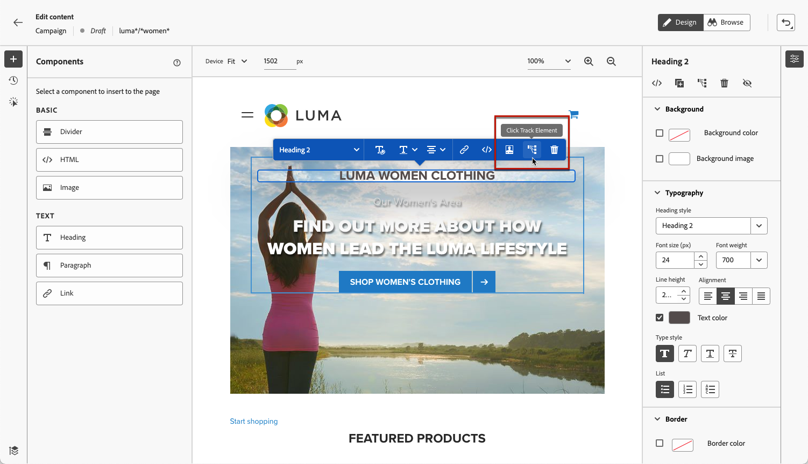
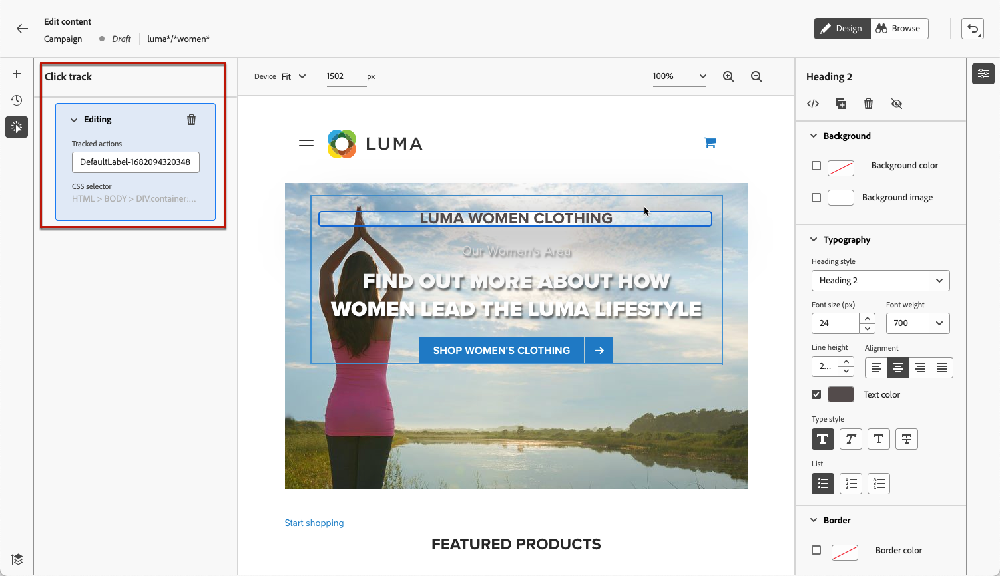

# 監視網站體驗 {#monitor-web-experiences}

## 檢查網頁報告 {#check-web-reports}

一旦您的網頁體驗上線，您可以檢查&#x200B;**[!UICONTROL 歷程報告]**&#x200B;和[行銷活動報告](../reports/journey-global-report-cja-web.md)的[網頁](../reports/campaign-global-report-cja-web.md)標籤，以比較曝光次數、點按率及與網頁互動次數等元素。

<!--You can check the **[!UICONTROL Web]** tab of the campaign reports. Learn more about the campaign web [live report](../reports/campaign-live-report.md#web-tab) and [global report](../reports/campaign-global-report-cja.md#web).-->

若要進一步改善網站體驗監控，您也可以追蹤網站任何特定元素的點按次數。 這可讓您在網頁報告中顯示該元素的點按次數。 [了解作法](#use-click-tracing)

## 使用點選追蹤 {#use-click-tracking}

網頁設計工具可讓您選取網站的任何元素，並追蹤對該元素的點按。

此資訊有助於改善網站使用者的體驗。 例如，如果[網頁報表](../reports/campaign-global-report-cja-web.md)顯示有許多使用者點按了實際上無法點按的元素，您可能會想要新增該元素的連結。

1. 在頁面中選取元素，然後從內容功能表中選擇&#x200B;**[!UICONTROL 按一下追蹤元素]**。

   

   >[!NOTE]
   >
   >可以選取任何專案，無論是否可點按。

1. 對應的追蹤動作會自動顯示在左側的&#x200B;**[!UICONTROL 點選追蹤]**&#x200B;窗格中。

   

1. 新增有意義的標籤以管理所有追蹤的元素，並在報表中輕鬆找到。 **[!UICONTROL CSS選取器]**&#x200B;欄位會顯示尋找所選專案的資訊。

1. 重複上述步驟，視需要選取點選追蹤所需數量的其他元素。 對應的動作會全部列在左窗格中。

   

1. 若要移除元素上的點選追蹤，請選取對應的刪除圖示。

一旦您的行銷活動上線，您就可以檢查行銷活動網頁[即時報告](../reports/campaign-live-report.md#web-tab)和[Customer Journey Analytics報告](../reports/campaign-global-report-cja-web.md)中每個元素的點按次數。
