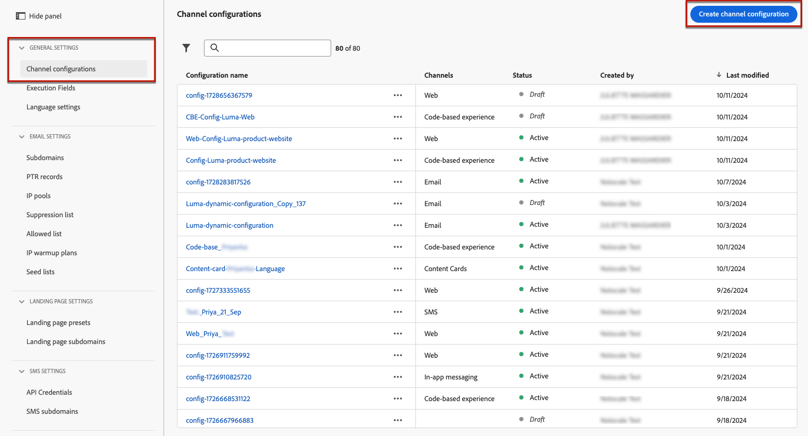
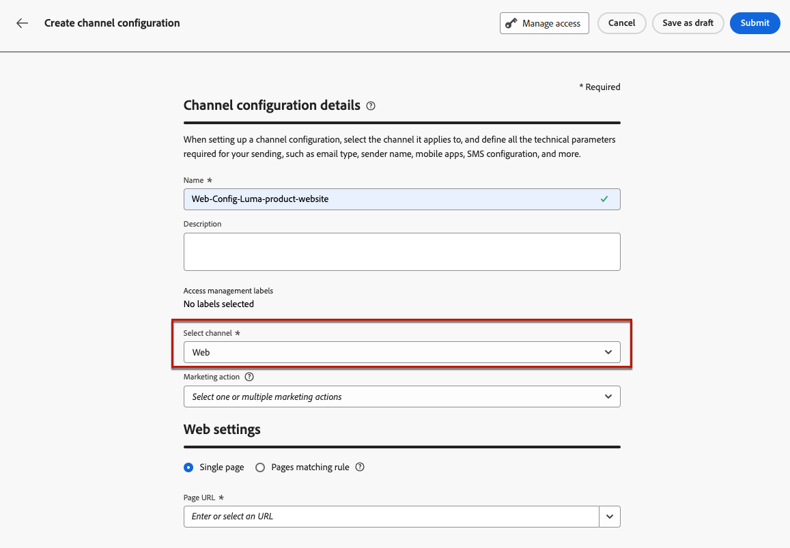
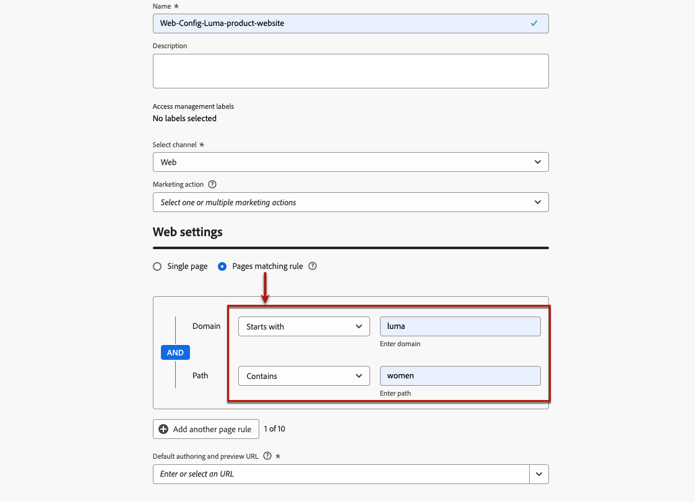
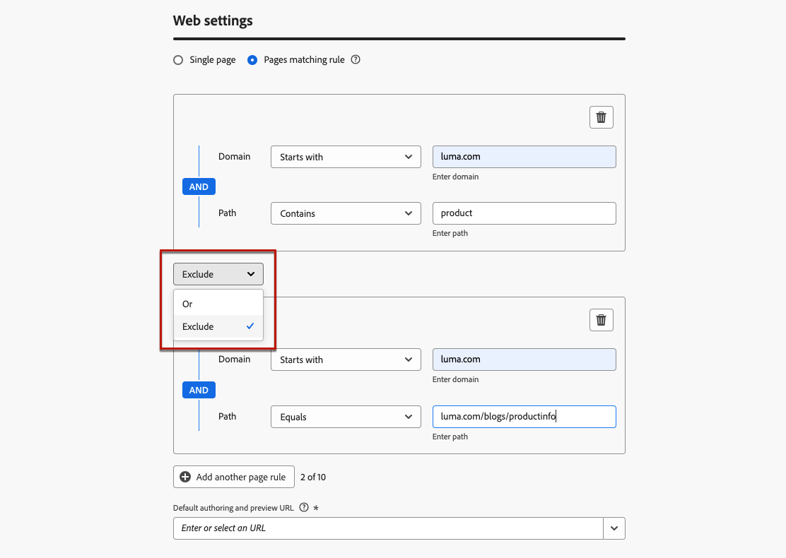

# 設定您的網站體驗 {#web-configuration}

## 建立Web頻道設定 {#create-web-configuration}

Web設定是由URL識別的Web屬性，將會傳送內容。 它可以比對單一頁面URL或多個頁面，讓您在一或多個網頁間提供修改內容。

若要建立Web Channel設定，請遵循以下步驟。

1. 存取&#x200B;**[!UICONTROL 頻道]** > **[!UICONTROL 一般設定]** > **[!UICONTROL 頻道設定]**&#x200B;功能表，然後按一下&#x200B;**[!UICONTROL 建立頻道設定]**。

   

1. 輸入設定的名稱和說明（選擇性）。

   >[!NOTE]
   >
   > 名稱必須以字母(A-Z)開頭。 它只能包含英數字元。 您也可以使用底線 `_`、點 `.` 和連字號 `-` 字元。

1. 若要將自訂或核心資料使用標籤指派給組態，您可以選取&#x200B;**[!UICONTROL 管理存取權]**。 [進一步瞭解物件層級存取控制(OLAC)](../administration/object-based-access.md)

1. 選取&#x200B;**Web**&#x200B;管道。

   

1. 選取&#x200B;**[!UICONTROL 行銷動作]**，以使用此設定將同意原則與訊息相關聯。 系統會運用與行銷動作相關的所有同意政策，以尊重客戶的偏好設定。 [了解更多](../action/consent.md#surface-marketing-actions)

1. 在&#x200B;**[!UICONTROL 網頁設定]**&#x200B;區段中，選取下列其中一個選項：

   * **[!UICONTROL 單一頁面]** — 如果您只想將變更套用至單一頁面，請輸入&#x200B;**[!UICONTROL 頁面URL]**。

   * **[!UICONTROL 符合規則的頁面]** — 若要鎖定多個符合相同規則的URL，請建置符合規則的頁面，並輸入&#x200B;**[!UICONTROL 預設的撰寫和預覽URL]**。 [了解更多](#web-page-matching-rule)

1. 按一下&#x200B;**[!UICONTROL 提交]**&#x200B;以儲存變更。

現在當您在行銷活動或歷程中使用網路管道時，可以選取此設定。

## 建置頁面比對規則 {#web-page-matching-rule}

>[!CONTEXTUALHELP]
>id="ajo_admin_page_rule"
>title="建置頁面比對規則"
>abstract="若要有效管理和鎖定共用相同準則的 URL 群組，請建立頁面比對規則。此規則可讓您將多個 URL 合併至一個準則下，以便更輕鬆在這些頁面間套用一致的設定和動作。"

>[!CONTEXTUALHELP]
>id="ajo_admin_default_url"
>title="定義內容製作和預覽 URL"
>abstract="此欄位可確保根據規則產生或符合的頁面具有指定的 URL，這對於有效建立和預覽內容至關重要。"

建立網頁或[程式碼型體驗](../code-based/get-started-code-based.md)設定時，您可以建置符合規則&#x200B;**[!UICONTROL 的]**&#x200B;頁面，以鎖定多個符合相同規則的URL。 因此，您可以一次將相同的內容變更套用至多個頁面。

例如，您可能會想要將變更套用至整個網站的主圖橫幅，或新增顯示在網站所有產品頁面上的最上方影像。

1. 設定您的[網頁](#web-configuration)或[程式碼型體驗](../code-based/code-based-configuration.md)時，請選取&#x200B;**[!UICONTROL 符合規則]**&#x200B;的頁面。

1. 定義&#x200B;**[!UICONTROL 網域]**&#x200B;和&#x200B;**[!UICONTROL 頁面]**&#x200B;欄位的條件。

   >[!NOTE]
   >
   >檢查[此區段](#available-operators)中可用的運運算元。

   例如，如果您想要編輯顯示在Luma網站所有女性產品頁面上的元素，請選取&#x200B;**[!UICONTROL 網域]** > **[!UICONTROL 開頭為]** > `luma`和&#x200B;**[!UICONTROL 頁面]** > **[!UICONTROL 包含]** > `women`。

   

1. 如果您的使用案例無法使用單一規則建模，您可以選擇新增多個規則。 按一下&#x200B;**[!UICONTROL 新增其他頁面規則]**&#x200B;並重複上述步驟。

   >[!NOTE]
   >
   >您最多可以新增10個規則。

1. 您可以在不同的規則之間使用&#x200B;**[!UICONTROL Or]**&#x200B;或&#x200B;**[!UICONTROL Exclude]**&#x200B;運運算元。

   當符合所定義規則的其中一個頁面不應作為目標時，**[!UICONTROL 排除]**&#x200B;會很有用。 例如，您可以鎖定包含`luma.com`的所有`product`頁面，排除下列頁面： `https://luma.com/blogs/productinfo`。

   

1. 輸入&#x200B;**[!UICONTROL 預設的撰寫與預覽URL]**。 此步驟會確保規則產生或相符的頁面具有用於內容建立和預覽的指定URL。

### 建立頁面比對規則的可用運運算元 {#available-operators}

建立符合多個頁面[的](#web-page-matching-rule)規則時，您可以在&#x200B;**[!UICONTROL 網域]**&#x200B;和&#x200B;**[!UICONTROL 路徑]**&#x200B;區段上使用不同的運運算元來建置您想要的規則。 可用的運運算元如下所列。

* **網域**

  | 運運算元  | 說明  | 範例  |
  |---|---|---|
  | 等於  | 網域的完全相符專案。  | |
  | 開頭為  | 符合以輸入字串開頭的所有網域（包括子網域）。  | 例如：「開頭為：dev」 ->符合開頭為「dev」的所有網域和子網域，例如：dev.example.com、dev.products.example.com、developer.example.com  |
  | 結尾為  | 比對以輸入字串結尾的所有網域（包括子網域）。  | 例如：「結尾為：example.com」 ->會比對所有結尾為「example.com」的網域和子網域，例如：stage.example.com、prod.example.com、myexample.com  |
  | 萬用字元比對  | 「萬用字元符合」運運算元可讓使用者在字串中間定義萬用字元符合，例如「dev」。*.example.com」。 驗證規則是當運運算元為「萬用字元比對」時，值必須包含且僅包含一個萬用字元（星號）。  | 例如：「萬用字元符合： dev.*.example.com&quot; ->會比對下列網域：dev.products.example.com、dev.mytest.products.example.com、dev.blog.example.com  |
  | 任何  | 符合所有網域 — 在跨網域測試特定路徑時很有用  |  |

* **路徑**

<table>
    <thead>
    <tr>
        <th><strong>運算子</th>
        <th><strong>說明</th>
        <th><strong>範例</th>
    </tr>
    </thead>
    <tbody>
    <tr>
        <td>等於</td>
        <td>路徑的確切相符專案。 </td>
        <td></td>
    </tr>
    <tr>
        <td>開始於</td>
        <td>比對以輸入字串開頭的所有路徑（包括子路徑）。</td>
        <td></td>
    </tr>
    <tr>
        <td>結束於</td>
        <td>比對以輸入字串結尾的所有路徑（包括子路徑）。</td>
        <td></td>
    </tr>
    <tr>
        <td>任何</td>
        <td>比對所有路徑 — 當鎖定一個或多個網域下的所有路徑時，這個用法很有用。</td>
        <td></td>
    </tr>
    <tr>
        <td>萬用字元比對</td>
        <td>「萬用字元符合」運運算元可讓使用者在路徑內定義內部萬用字元，例如"/products/*/detail"。  路徑**元件中的萬用字元*會比對任何字元順序，直到遇到第一個/字元為止。  /*/符合任何字元順序（包括子路徑）</td>
        <td>例如：「萬用字元符合：/products/*/detail」，符合所有路徑，例如： <ul><li>example.com/products/yoga/detail</li><li>example.com/products/surf/detail</li><li>example.com/products/tennis/detail</li><li>example.com/products/yoga/pants/detail</li></ul>例如：「符合： /prod*/detail，符合所有路徑，例如： <ul><li>example.com/products/detail</li><li>example.com/production/detail</li></ul>不符合如下的路徑： <ul><li>example.com/products/yoga/detail</li></ul></td>
    </tr>
    <tr>
        <td>包含</td>
        <td>"contains"會轉譯為"mystring"之類的萬用字元，並比對包含此字元序列的所有路徑。</td>
        <td>例如：「包含：產品」，符合包含字串產品的所有路徑，例如： <ul><li>example.com/products</li><li>example.com/yoga/perfproduct</li><li>example.com/surf/productdescription</li><li>example.com/home/product/page</li></ul></td>
    </tr>
    </tbody>
</table>
