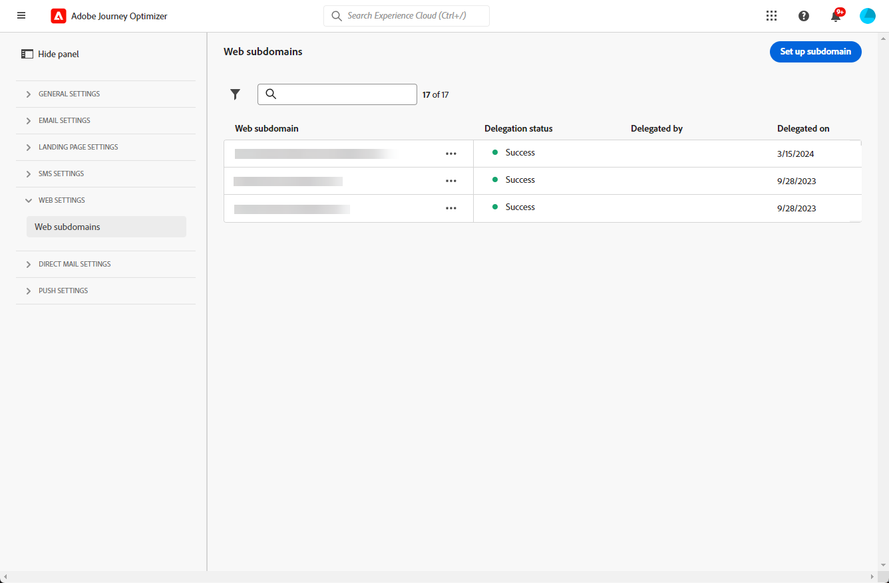

# 設定網頁子網域 {#web-subdomains}

>[!CONTEXTUALHELP]
>id="ajo_admin_subdomain_web_header"
>title="委派網頁子網域"
>abstract="您將設定您的子網域以供網頁管道使用。您可以使用已委派給 Adobe 的子網域，或設定另一個子網域。"

>[!CONTEXTUALHELP]
>id="ajo_admin_subdomain_web"
>title="委派網頁子網域"
>abstract="如果您將來自 Adobe Experience Manager Assets 的內容新增到您的網頁體驗中，則必須設定將用來發佈此內容的子網域。選取已委派給 Adobe 的子網域，或設定新的子網域。"

>[!CONTEXTUALHELP]
>id="ajo_admin_subdomain_web_default"
>title="設定網頁子網域"
>abstract="從已委派給 Adobe 的子網域清單中選取一個子網域。您可以將此網頁子網域設定為預設子網域，但一次只能使用一個預設子網域。"

## 開始使用Web子網域 {#gs-web-subdomains}

編寫網頁體驗時，如果您新增來自[Adobe Experience Manager Assets](../integrations/assets.md)資料庫的內容，則必須設定用於發佈此內容的子網域。

您可以使用已委派給Adobe的子網域，也可以設定另一個子網域。 在[本節](../configuration/delegate-subdomain.md)中進一步瞭解將子網域委派至Adobe。

Web子網域設定是&#x200B;**所有環境通用的設定**。 因此：

* 若要存取和編輯Web子網域，您必須對生產沙箱具有&#x200B;**[!UICONTROL 管理Web子網域]**&#x200B;許可權。

* 對Web子網域所做的任何修改也會影響生產沙箱。

您可以建立數個網頁子網域，但只會使用&#x200B;**預設**&#x200B;子網域。 您可以變更預設的網頁子網域，但一次只能使用一個子網域。

## 存取及管理Web子網域 {#access-web-subdomains}

若要存取網頁體驗的子網域，請遵循下列步驟：

1. 瀏覽至&#x200B;**[!UICONTROL 管理]** > **[!UICONTROL 管道]**&#x200B;功能表，然後選取&#x200B;**[!UICONTROL 網頁設定]** > **[!UICONTROL 網頁子網域]**。 會顯示使用目前沙箱設定的所有子網域。

   

1. 您可以篩選委派每個子網域的使用者或其中一個委派狀態（**[!UICONTROL 草稿]**、**[!UICONTROL 正在處理]**、**[!UICONTROL 成功]**&#x200B;或&#x200B;**[!UICONTROL 失敗]**）。

   

1. **[!UICONTROL 預設]**&#x200B;徽章會顯示在目前作為預設的子網域旁邊。 若要變更預設子網域，請從所要子網域旁的&#x200B;**[!UICONTROL 更多動作]**&#x200B;按鈕中選取&#x200B;**[!UICONTROL 設定為預設值]**。

   

   您可以變更預設的網頁子網域，但一次只能使用一個子網域。

## 使用現有的子網域 {#web-use-existing-subdomain}

若要使用已委派給Adobe的子網域，請遵循下列步驟：

1. 存取&#x200B;**[!UICONTROL 管理]** > **[!UICONTROL 管道]**&#x200B;功能表，然後選取&#x200B;**[!UICONTROL 網頁設定]** > **[!UICONTROL 網頁子網域]**。

1. 按一下&#x200B;**[!UICONTROL 設定子網域]**。

1. 從&#x200B;**[!UICONTROL 組態型別]**&#x200B;區段中選取&#x200B;**[!UICONTROL 使用委派的子網域]**&#x200B;選項，並從清單中選擇委派的子網域。

   

   >[!NOTE]
   >
   >您無法選取已用作Web子網域的子網域。

1. 將會在網頁URL中顯示的前置詞會自動新增。 您無法加以變更。

1. 若要將此子網域設定為預設值，請選取對應的選項。

   

   只會使用&#x200B;**預設**&#x200B;子網域。

1. 按一下&#x200B;**[!UICONTROL 提交]**。 子網域取得&#x200B;**[!UICONTROL Success]**&#x200B;狀態。 它可供您的網頁體驗使用。

   在極少數的情況下，子網域設定可能會失敗。 在此情況下，您可以刪除&#x200B;**[!UICONTROL 失敗]**&#x200B;子網域，以使用&#x200B;**[!UICONTROL 更多動作]**&#x200B;圖示中的&#x200B;**[!UICONTROL 刪除]**&#x200B;按鈕來清除清單。

## 設定新的子網域 {#web-configure-new-subdomain}

>[!CONTEXTUALHELP]
>id="ajo_admin_web_subdomain_dns"
>title="產生相符的 DNS 記錄"
>abstract="若要設定新的 Web 子網域，您需要將 Journey Optimizer 介面中顯示的 Adobe 名稱伺服器資訊複製後貼到您的網域託管解決方案中，以產生相符的 DNS 記錄。檢查成功後，子網域即可用於發佈來自 Adobe Experience Manager Assets 資料庫的內容。"

依預設，[!DNL Journey Optimizer]可讓您委派總計&#x200B;**最多10個子網域** （涵蓋電子郵件和網路頻道）。 然而，根據您的授權合約，您最多可委派 100 個子網域。 請聯絡您的 Adobe 聯絡人，了解更多您有權使用的子網域數量。

若要設定新的子網域，請遵循下列步驟：

1. 存取&#x200B;**[!UICONTROL 管理]** > **[!UICONTROL 管道]**&#x200B;功能表，然後選取&#x200B;**[!UICONTROL 網頁設定]** > **[!UICONTROL 網頁子網域]**。

1. 按一下&#x200B;**[!UICONTROL 設定子網域]**。

1. 從&#x200B;**[!UICONTROL 組態型別]**&#x200B;區段中選取&#x200B;**[!UICONTROL 新增您自己的網域]**。

1. 指定要委派的子網域。

   >[!CAUTION]
   >
   >* 您無法使用現有的Web子網域。
   >
   >* 子網域中不允許使用大寫字母。

   

   不允許將無效的子網域委派給Adobe。 請務必輸入貴組織所擁有的有效子網域，例如marketing.yourcompany.com。

   支援（相同父項網域的）多階層子網域。 例如，您可以使用「web.marketing.yourcompany.com」。

1. 若要將此子網域設定為預設值，請選取對應的選項。

   >[!NOTE]
   >
   >只會使用&#x200B;**預設**&#x200B;子網域。

1. 將會顯示要放置在DNS伺服器中的記錄。 複製此記錄或下載CSV檔案，然後導覽至您的網域託管解決方案，以產生相符的DNS記錄。

1. 請確定已在您的網域託管解決方案中產生DNS記錄。 如果所有專案皆已正確設定，請勾選「我確認……」方塊，然後按一下&#x200B;**[!UICONTROL 提交]**。

   

   當您設定新的網頁子網域時，它始終指向CNAME記錄。

1. 提交子網域委派後，子網域會顯示在狀態為&#x200B;**[!UICONTROL 處理中]**&#x200B;的清單中。 如需子網域狀態的詳細資訊，請參閱[本區段](../configuration/delegate-subdomain.md#access-delegated-subdomains).<!--Same statuses?-->

   您必須等到Adobe執行必要的檢查（最多可能需要&#x200B;**4小時**），才能使用該子網域來傳送網頁訊息。

1. 檢查成功後，子網域會取得&#x200B;**[!UICONTROL Success]**&#x200B;狀態。 它已準備好用於建立Web Channel設定。

   請注意，如果您無法在託管解決方案上建立驗證記錄，子網域將會標示為&#x200B;**[!UICONTROL 失敗]**。

<!--
Only a subdomain with the **[!UICONTROL Success]** status can be set as default.
You cannot delete a subdomain with the **[!UICONTROL Processing]** status.
-->

## 取消委派子網域 {#undelegate-subdomain}

如果您想要解除委派網頁子網域，請聯絡您的Adobe代表，告知您要解除委派的子網域。

<!--
1. Deactivate all the channel configurations associated with the subdomain. [Learn how](../configuration/channel-surfaces.md#deactivate-a-surface)

1. Stop the active campaigns associated with the subdomains. [Learn how](../campaigns/manage-campaigns.md#stop)

1. Stop the active journeys associated with the subdomains. [Learn how](../building-journeys/end-journey.md#stop-journey)-->

如果Web子網域是[新的委派子網域](#web-configure-new-subdomain)，您可以從託管解決方案中刪除您為Web子網域建立的CNAME DNS記錄（但若有的話，請勿刪除原始電子郵件子網域）。

Adobe處理您的請求後，未委派網域不再顯示在子網域詳細目錄頁面上。
