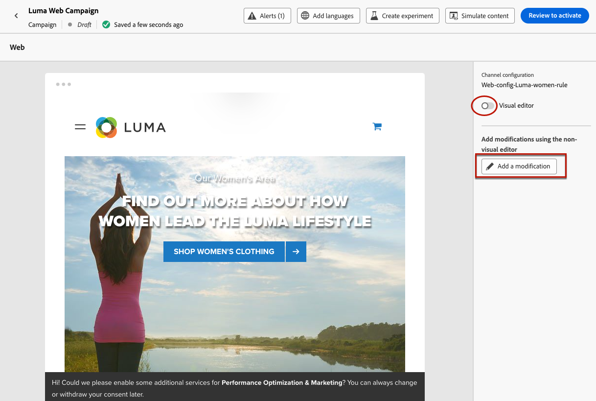
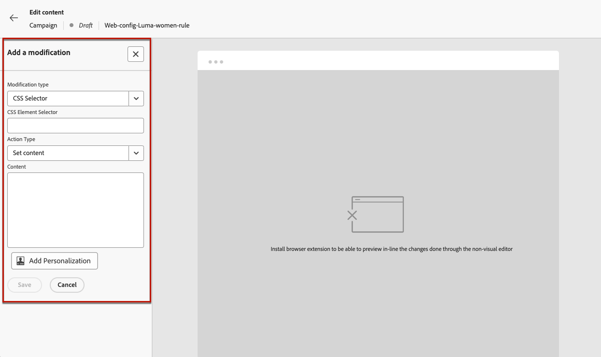
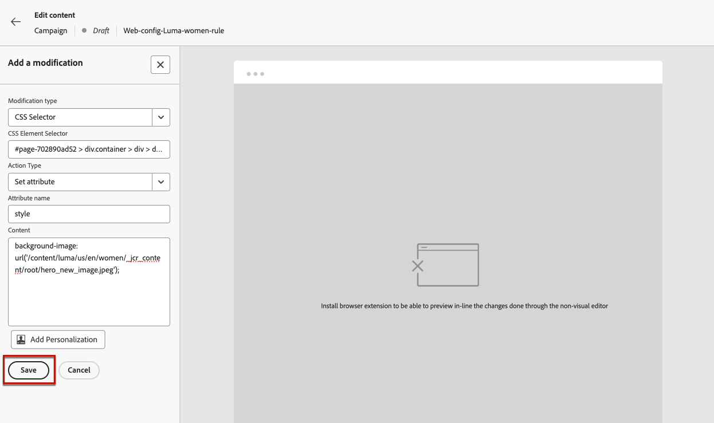
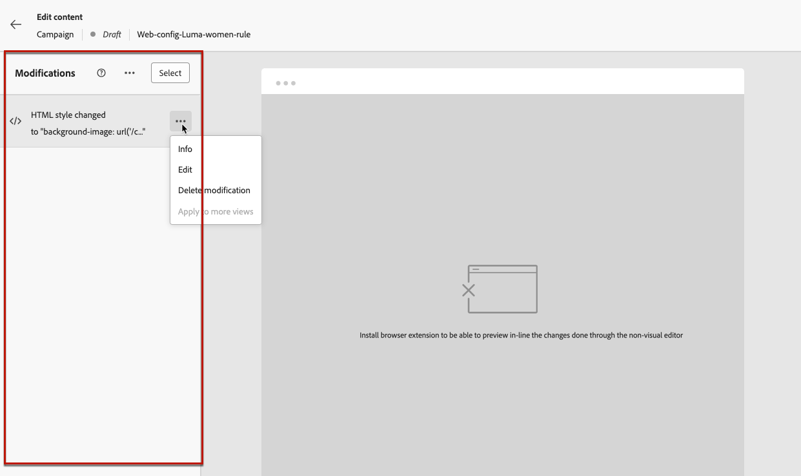
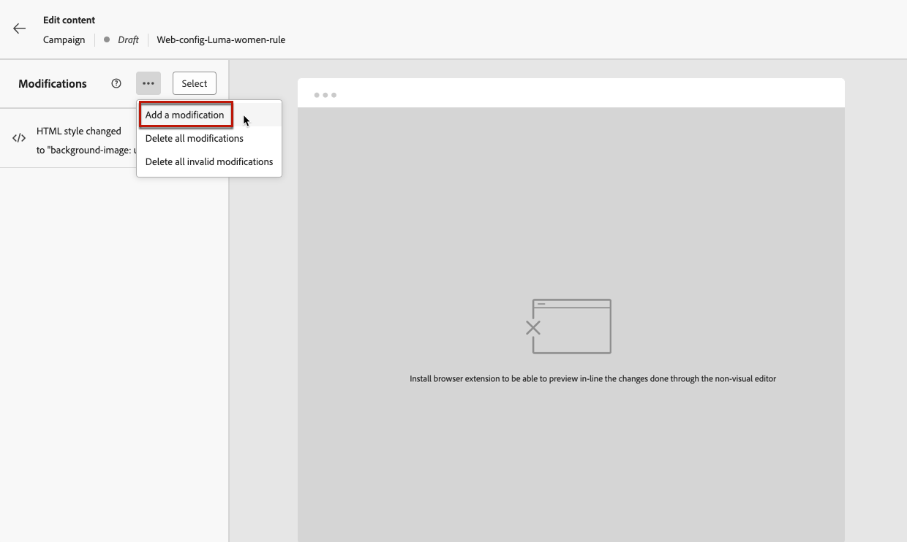
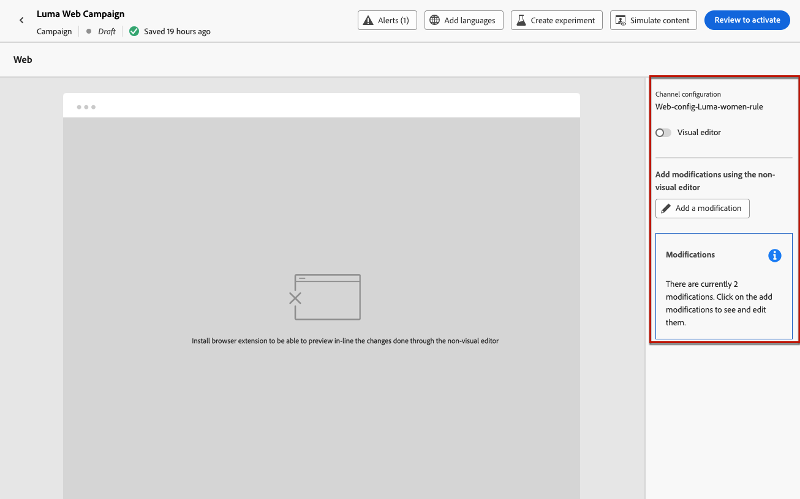
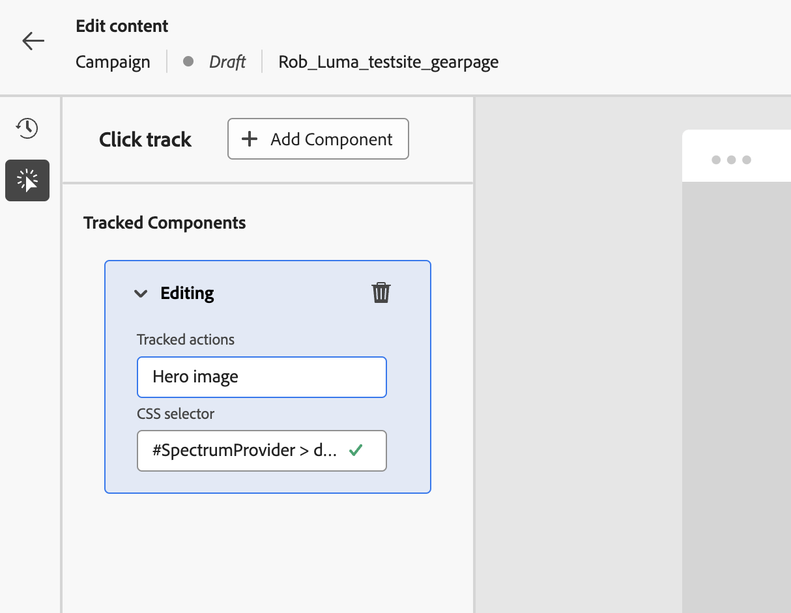

# 使用網頁非視覺化編輯器 {#web-non-visual-editor}

除了[!DNL Journey Optimizer]視覺化[網頁設計工具](web-visual-editor.md)之外，您也可以使用&#x200B;**非視覺化編輯器**&#x200B;來新增網頁的修改。

如果您無法或不允許安裝瀏覽器延伸模組，例如[Adobe Experience Cloud Visual Helper](web-prerequisites.md#visual-authoring-prerequisites)，這是在Web設計工具中載入網頁所需。

在某些情況下，您可能會發現使用非視覺化編輯器對特定CSS選取器套用修改內容更容易，而不會冒修改網頁上其他元素或變更頁面結構的風險。

若要使用非視覺化編輯器編寫您的Web體驗，請遵循下列步驟。

1. 在歷程或行銷活動中的&#x200B;**[!UICONTROL 編輯內容]**&#x200B;畫面中，取消選取&#x200B;**[!UICONTROL 視覺編輯器]**&#x200B;選項。

1. 按一下&#x200B;**[!UICONTROL 新增修改]**&#x200B;以開始編輯您的網頁內容。

   

1. 非視覺化編輯器隨即顯示。 您可以使用左窗格新增第一次修改。

   

1. 選取修改型別：

   * **[!UICONTROL CSS選擇器]** - [深入瞭解](manage-web-modifications.md#css-selector)
   * **[!UICONTROL 頁面`<Head>`]** - [深入瞭解](manage-web-modifications.md#page-head)

1. 按一下&#x200B;**[!UICONTROL 進階編輯選項]**&#x200B;按鈕。 個人化編輯器隨即開啟。

   您可以善用[!DNL Journey Optimizer]個人化編輯器及其所有個人化和編寫功能。 [了解更多](../personalization/personalization-build-expressions.md)

1. 輸入您的內容並&#x200B;**[!UICONTROL 儲存]**&#x200B;您的變更。

   

1. 您的第一次修改會顯示在&#x200B;**[!UICONTROL 修改]**&#x200B;窗格上方。

   按一下您修改旁的&#x200B;**[!UICONTROL 更多動作]**&#x200B;按鈕，並選取&#x200B;**[!UICONTROL 資訊]**&#x200B;以顯示其詳細資料。 您也可以&#x200B;**[!UICONTROL 編輯]**&#x200B;或&#x200B;**[!UICONTROL 刪除]**&#x200B;修改。

   

   >[!NOTE]
   >
   >**[!UICONTROL 修改]**&#x200B;窗格與使用[網頁設計工具](web-visual-editor.md)時相同。 您可用它執行的所有動作都在[本節](manage-web-modifications.md#use-modifications-pane)中詳細說明。

1. 按一下&#x200B;**[!UICONTROL 修改]**&#x200B;窗格頂端的&#x200B;**[!UICONTROL 更多動作]**&#x200B;按鈕以&#x200B;**[!UICONTROL 新增修改]**，並重複上述步驟。 [了解更多](manage-web-modifications.md#add-modifications)

   

1. 選取畫面左上方的箭頭，返回歷程或行銷活動版本畫面。 您可以檢視目前的變更數目，並新增更多修改。

   

   如有需要，您也可以切換為網頁設計工具。 您的所有修改將會保留。

1. 您可以選取網站的任何元素並追蹤對該元素的點按。 若要啟用點選追蹤並定義要追蹤的動作，請按一下左側邊欄上的第二個圖示，如下所示：

   

   使用&#x200B;**新增元件**&#x200B;按鈕來選取要追蹤的新動作。 在[本節](monitor-web-experiences.md#use-click-tracking)中進一步瞭解點選追蹤使用量。
