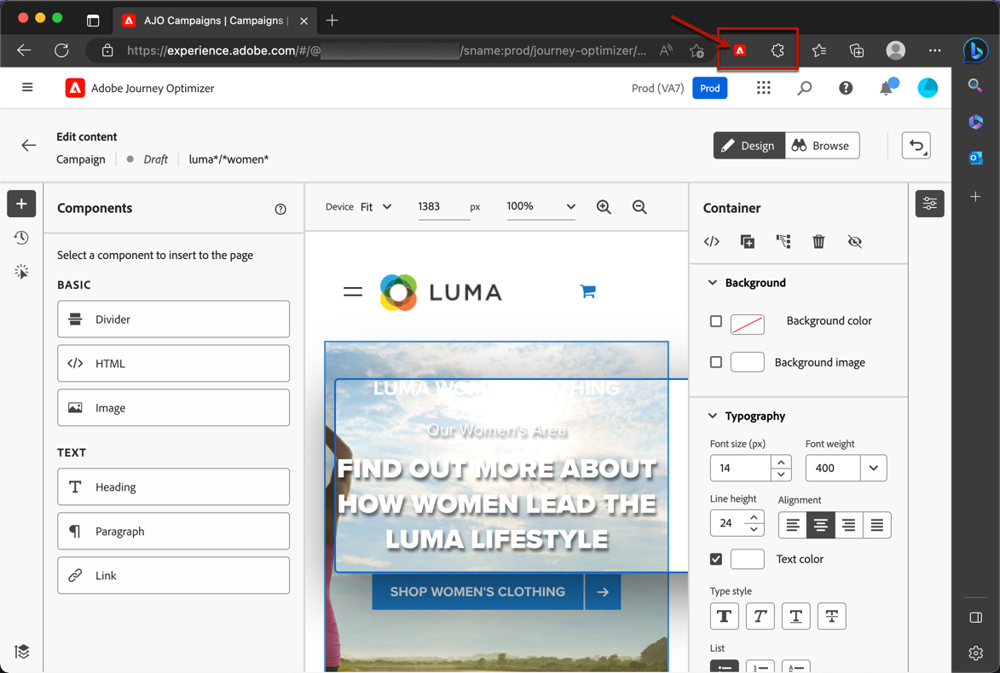

# 先決條件和護欄 {#web-prerequisites}

若要能夠在[!DNL Journey Optimizer]使用者介面中存取及製作網頁，請遵循下列必要條件：

* 若要對網站新增修改，您必須具備特定實施。 [了解更多](#implementation-prerequisites)

* 若要存取[!DNL Journey Optimizer]網頁設計工具，您必須安裝特定的Google Chrome瀏覽器擴充功能。 [了解更多](#visual-authoring-prerequisites)

* 若要正確傳遞Web體驗，請務必在[這裡](#delivery-prerequisites)定義詳細的Adobe Experience Platform設定。

* 若要啟用Web Channel的報告，您必須確定您的Web實作資料流中使用的資料集也包含在您的報告設定中。 [了解更多](#experiment-prerequisites)

>[!NOTE]
>
>以您的網頁定位假名設定檔（未驗證的訪客）時，請考慮設定自動刪除設定檔的存留時間(TTL)，以管理可參與的設定檔計數及相關成本。 [了解更多](#profile-management-guardrail)

## 實作必要條件 {#implementation-prerequisites}

支援兩種型別的實作，以便能在您的Web屬性上製作和傳送Web Channel行銷活動：

* 僅限使用者端 — 若要對您的網站新增修改，您必須在您的網站上實作[Adobe Experience Platform Web SDK](https://experienceleague.adobe.com/docs/platform-learn/implement-web-sdk/overview.html?lang=zh-Hant){target="_blank"}。

  >[!NOTE]
  >
  >請確定您的[Adobe Experience Platform Web SDK版本](https://experienceleague.adobe.com/en/docs/experience-platform/web-sdk/release-notes){target="_blank"}是2.16或更高版本。

* 混合模式 — 您可以使用[AEP Edge Network Server API](https://experienceleague.adobe.com/docs/experience-platform/edge-network-server-api/data-collection/interactive-data-collection.html?lang=zh-Hant){target="_blank"}來要求個人化伺服器端；回應會提供給Adobe Experience Platform Web SDK，以轉譯修改內容的使用者端。 在Adobe Experience Platform [Edge Network Server API檔案](https://experienceleague.adobe.com/docs/experience-platform/edge-network-server-api/overview.html){target="_blank"}中進一步瞭解。 您可以在[此部落格](https://blog.developer.adobe.com/hybrid-personalization-in-the-adobe-experience-platform-web-sdk-6a1bb674bf41){target="_blank"}中找到更多有關混合模式的資訊，並檢視一些實作範例。

>[!NOTE]
>
>Web Channel目前不支援僅伺服器端實作。 如果您的網頁只有伺服器端實作，您可以改用[程式碼型體驗管道](../code-based/get-started-code-based.md)。

<!--If the Adobe Experience Platform Web SDK is not yet implemented on the website, a message displays in the web designer suggesting that you install the Visual Editing Helper browser extension and implement the [Web SDK](https://experienceleague.adobe.com/docs/platform-learn/implement-web-sdk/overview.html){target="_blank"}.-->

## 視覺化製作先決條件 {#visual-authoring-prerequisites}

>[!CONTEXTUALHELP]
>id="ajo_web_browser_extension"
>title="建置頁面比對規則"
>abstract="若要存取 [!DNL Journey Optimizer] 網頁設計工具，您必須安裝特定的瀏覽器擴充功能：Adobe Experience Cloud Visual Editing Helper (僅適用於 Google Chrome 或 Microsoft Edge)。"

<!--In order to rapidly author and preview your web experiences, the Adobe Experience Cloud Visual Editing Helper browser extension for Google Chrome lets you load websites reliably within the Adobe [!DNL Journey Optimizer] web designer.-->

若要以可靠的方式在[!DNL Journey Optimizer]網頁設計工具中開啟、製作及預覽網頁，您的網頁瀏覽器上必須安裝[Adobe Experience Cloud Visual Editing Helper](https://chrome.google.com/webstore/detail/adobe-experience-cloud-vi/kgmjjkfjacffaebgpkpcllakjifppnca){target="_blank"}瀏覽器擴充功能。

>[!CAUTION]
>
>Google Chrome和Microsoft Edge目前是僅有的支援[!DNL Journey Optimizer]網頁製作功能的瀏覽器。

### 安裝Visual Editing Helper擴充功能 {#install-visual-editing-helper}

若要下載並安裝Visual Editing Helper瀏覽器擴充功能，請遵循下列步驟。

1. 在瀏覽器中開啟新標籤(Google Chrome或Microsoft Edge)。

1. 前往[Google Chrome網站商店](https://chrome.google.com/webstore/category/extensions){target="_blank"}。

1. 如果您正在使用Microsoft Edge，請選取頂端橫幅上的&#x200B;**[!UICONTROL 允許其他商店的擴充功能]**。 這可讓您將擴充功能從Chrome網站商店新增至Microsoft Edge。

1. 搜尋並導覽至[Adobe Experience Cloud Visual Editing Helper](https://chrome.google.com/webstore/detail/adobe-experience-cloud-vi/kgmjjkfjacffaebgpkpcllakjifppnca){target="_blank"}瀏覽器擴充功能。

1. 按一下&#x200B;**[!UICONTROL 新增至Chrome]** > **[!UICONTROL 新增擴充功能]**。

   >[!NOTE]
   >
   >如果您使用Microsoft Edge，即使按鈕標示為「新增至Edge」**&#x200B;**，此動作仍會將擴充功能新增至Chrome。

1. 請確定已在瀏覽器的工具列中正確啟用Visual Editing Helper瀏覽器擴充功能。

   

現在，當在[!DNL Journey Optimizer] [網頁設計工具](web-visual-editor.md)中開啟網站以進行編寫時，會自動啟用Adobe Experience Cloud Visual Editing Helper。

擴充功能沒有任何條件設定，且會自動處理所有設定，包括SameSite Cookie設定。

>[!NOTE]
>
>由於下列其中一個原因，某些網站可能無法可靠地在[!DNL Journey Optimizer]網頁設計工具中開啟：
>
> * 網站的安全性原則非常嚴格。
> * 網站位於iframe中。
> * 外部無法存取客戶的QA或預備網站（網站為內部網站）。

### 疑難排解網站未載入 {#troubleshooting}

使用Adobe [!DNL Journey Optimizer]網頁設計工具時，如果嘗試載入無法載入的網站，會顯示一則訊息，建議您安裝[Visual Editing Helper瀏覽器擴充功能](#install-visual-editing-helper)。

1. 請確定Visual Editing Helper瀏覽器擴充功能已正確安裝。

1. 如果網站仍發生未預期的行為，請確定您的瀏覽器允許第三方Cookie，否則網頁無法在[!DNL Journey Optimizer]網頁設計工具中載入。

對於驗證下的頁面，如果登入頁面無法載入，或嘗試登入後您仍未登入：

1. 嘗試先在新瀏覽器標籤中登入，並導覽至所需的頁面，然後複製URL並嘗試在[!DNL Journey Optimizer]網頁設計工具中開啟它。

2. 如果您還是無法在[!DNL Journey Optimizer]網頁設計工具中載入網站，請連絡Adobe客戶服務以回報問題，並確定您指定了失敗的URL。

## 傳遞必要條件 {#delivery-prerequisites}

若要正確傳送Web體驗，必須定義下列設定：

* 在[Adobe Experience Platform Data Collection](https://experienceleague.adobe.com/docs/experience-platform/edge/datastreams/overview.html?lang=zh-Hant){target="_blank"}中，確定您已定義資料串流，例如在&#x200B;**[!UICONTROL Adobe Experience Platform]**&#x200B;服務下您已啟用&#x200B;**[!UICONTROL Adobe Journey Optimizer]**&#x200B;選項。

  這可確保Adobe Experience Platform Edge正確處理Journey Optimizer傳入事件。 [了解更多](https://experienceleague.adobe.com/docs/experience-platform/edge/datastreams/configure.html){target="_blank"}

  

* 在[Adobe Experience Platform](https://experienceleague.adobe.com/docs/experience-platform/profile/home.html?lang=zh-Hant){target="_blank"}中，確定您有一個啟用&#x200B;**[!UICONTROL Edge上主動式合併原則]**&#x200B;選項的合併原則。 若要這麼做，請在&#x200B;**[!UICONTROL 客戶]** > **[!UICONTROL 設定檔]** > **[!UICONTROL 合併原則]** Experience Platform功能表下選取原則。 [了解更多](https://experienceleague.adobe.com/docs/experience-platform/profile/merge-policies/ui-guide.html#configure){target="_blank"}

  此合併原則由[!DNL Journey Optimizer]個傳入頻道使用，以便在邊緣正確啟用和發佈傳入行銷活動。 [了解更多](https://experienceleague.adobe.com/docs/experience-platform/profile/merge-policies/ui-guide.html?lang=zh-Hant){target="_blank"}

  

* 若要針對Journey Optimizer Web體驗的傳遞進行疑難排解，您可以在&#x200B;**Edge Delivery**&#x200B;中使用&#x200B;**Adobe Experience Platform Assurance**&#x200B;檢視。 此外掛程式可讓您詳細檢查請求呼叫、驗證預期的邊緣呼叫是否如預期發生，以及檢查設定檔資料，包括身分對應、區段會籍和同意設定。 此外，您可以檢閱請求符合資格的活動，並識別未符合資格的活動。

  使用&#x200B;**Edge Delivery**&#x200B;外掛程式可協助您取得所需的深入分析，以有效瞭解並疑難排解傳入的實作。

  [進一步瞭解Edge Delivery檢視](https://experienceleague.adobe.com/zh-hant/docs/experience-platform/assurance/view/edge-delivery)

## 報表必要條件 {#experiment-prerequisites}

若要啟用Web Channel的報告，您必須確定在您的Web實作[資料流](../data/get-started-datasets.md)中使用的[資料集](https://experienceleague.adobe.com/docs/experience-platform/datastreams/overview.html){target="_blank"}也包含在您的報告設定中。

換言之，在設定報告時，如果您新增的資料集不存在您的網路資料流中，網路資料將不會顯示在您的報告中。

瞭解如何在[本節](../reports/reporting-configuration.md#add-datasets)中新增資料集以進行報告。

>[!NOTE]
>
>資料集由[!DNL Journey Optimizer]報告系統以唯讀方式使用，不會影響資料收集或資料擷取。

如果您&#x200B;**不是**，使用資料集結構描述的下列預先定義[欄位群組](https://experienceleague.adobe.com/docs/experience-platform/xdm/tutorials/create-schema-ui.html?lang=zh-Hant#field-group){target="_blank"}： `AEP Web SDK ExperienceEvent`和`Consumer Experience Event` （如[此頁面](https://experienceleague.adobe.com/docs/platform-learn/implement-web-sdk/initial-configuration/configure-schemas.html#add-field-groups){target="_blank"}上所定義），請務必新增下列欄位群組： `Experience Event - Proposition Interactions`、`Application Details`、`Commerce Details`和`Web Details`。 [!DNL Journey Optimizer]報告需要這些資料，因為它們正在追蹤每個設定檔參與了哪些行銷活動和歷程。

[深入瞭解報告設定](../reports/reporting-configuration.md)

>[!NOTE]
>
>新增這些欄位群組不會影響正常的資料收集。 它僅適用於執行行銷活動或歷程的頁面，而保留所有其他追蹤不變。

## 資產的品牌網域 {#branded-domains-for-assets}

編寫網頁體驗時，如果您新增來自[Adobe Experience Manager Assets](../integrations/assets.md)資料庫的內容，則必須設定用於發佈此內容的子網域。 [了解更多](web-delegated-subdomains.md)

## 設定檔管理護欄 {#profile-management-guardrail}

[!DNL Journey Optimizer]個網頁行銷活動可以鎖定假名設定檔，這表示設定檔尚未驗證或還不知道，因為它們之前從未在其他頻道上參與。 例如，當根據類似ECID的暫時ID來鎖定所有訪客或對象時，就會發生這種情況。

這會增加您的可參與設定檔總數，如果您購買的可參與設定檔數目超過合約，可能會影響成本。 每個套件的授權量度都列在[Journey Optimizer產品說明](https://helpx.adobe.com/tw/legal/product-descriptions/adobe-journey-optimizer.html){target="_blank"}頁面上。 您可以在[授權使用儀表板](../audience/license-usage.md)中檢查可參與的設定檔數目。

為了將您的參與設定檔保持在合理限制內，Adobe建議設定存留時間(TTL) ，以在指定時間範圍內未看到或未參與的匿名設定檔時，自動從即時客戶設定檔中刪除該設定檔。

>[!NOTE]
>
>在[Experience Platform檔案](https://experienceleague.adobe.com/zh-hant/docs/experience-platform/profile/pseudonymous-profiles){target="_blank"}中瞭解如何設定假名設定檔的資料有效期。

Adobe建議將TTL值設為14天，以符合目前的Edge設定檔TTL。
