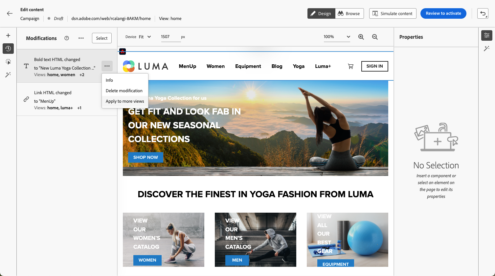

# 編寫單頁應用程式 {#web-author-spas}

## 關於視圖 {#about-views}

>[!CONTEXTUALHELP]
>id="ajo_web_designer_modifications_views"
>title="將變更套用到選取的視圖"
>abstract="變更將僅套用到選取的視圖。可以使用&#x200B;**瀏覽**&#x200B;模式找到並瀏覽到視圖。找不到您要尋找的視圖？"
>additional-url="https://experienceleague.adobe.com/docs/platform-learn/implement-web-sdk/overview.html?lang=zh-Hant" text="了解更多"

**單頁應用程式** (SPA)現在可以在網頁設計工具視覺化編輯器中撰寫。 這可讓您選取要套用網頁修改的特定的&#x200B;**檢視**。

[透過此影片瞭解如何編寫單頁應用程式](#video)

檢視可定義為整個網站或網站上一組視覺元素，例如首頁、整個產品網站或所有結帳頁面上的傳遞偏好設定框架。

需要一次性開發人員設定，才能在Adobe Experience Platform Web SDK實作中定義檢視。 這可讓您在SPA上建立並執行Adobe Journey Optimizer網路行銷活動。

## 在網頁SDK實作中定義檢視 {#define-views}

在Adobe [!DNL Journey Optimizer]中可運用XDM檢視，讓行銷人員能夠透過Web視覺編輯器在SPA上執行Web個人化和實驗行銷活動。 [了解更多](https://experienceleague.adobe.com/docs/experience-platform/edge/personalization/ajo/web-spa-implementation.html?lang=zh-Hant){target="_blank"}

若要能夠在[!DNL Journey Optimizer]使用者介面中存取及編寫檢視，請務必遵循[本節](https://experienceleague.adobe.com/docs/experience-platform/edge/personalization/ajo/web-spa-implementation.html#implement-xdm-views){target="_blank"}中列出的步驟。

## 在網頁設計工具中探索檢視 {#discover-views}

在Adobe Experience Platform Web SDK實作中完成SPA設定後，您需要導覽您要套用修改之網站的所有檢視。 請遵循下列步驟。

1. [建立網頁歷程或行銷活動](create-web.md)並存取[網頁設計工具](web-visual-editor.md)。

   您目前所在的檢視畫面會顯示在左上方。

   

1. 切換至&#x200B;**[!UICONTROL 瀏覽]**&#x200B;模式。 [了解更多](web-visual-editor.md#browse-mode)

   

1. 在網站的不同頁面之間導覽，以探索所有頁面。 當您瀏覽其他頁面時，最上方顯示的檢視名稱會變更。

   

## 將修改套用至其他檢視 {#apply-modifications-views}

當您在特定檢視中新增修改後，即可將其套用至其他選取的檢視。 請遵循下列步驟。

>[!CAUTION]
>
>如果您尚未使用&#x200B;**[!UICONTROL 瀏覽]**&#x200B;模式探索到檢視，您將無法選取它們以套用您的修改。 [了解更多](#discover-views)

1. 選取&#x200B;**[!UICONTROL 修改]**&#x200B;圖示以在左側顯示對應的窗格。

   

1. 選取任何修改，然後按一下旁邊的&#x200B;**[!UICONTROL 更多動作]**&#x200B;按鈕。 選取&#x200B;**[!UICONTROL 套用至更多檢視]**。

   

1. 選取您要套用變更的檢視。

   

1. 按一下&#x200B;**[!UICONTROL 套用]**。

1. 切換至&#x200B;**[!UICONTROL 瀏覽]**&#x200B;模式，檢查修改是否已套用至所要的頁面。

   

## 作法影片{#video}

此影片說明如何：

* 使用&#x200B;**[!UICONTROL 瀏覽]**&#x200B;模式探索SPA檢視
* 在目前的檢視上進行製作
* 將網站修改套用至多個檢視或所有探索到的檢視
* 對修改執行大量動作

>[!VIDEO](https://video.tv.adobe.com/v/3424536/?quality=12&learn=on)
