# 使用網頁設計工具 {#work-with-web-designer}

<!--
>[!CONTEXTUALHELP]
>id="ajo_web_url_to_edit_surface"
>title="Confirm the URL to edit"
>abstract="Confirm the URL of the specific web page to use for editing the content that will be applied on the web configuration defined above. The web page must be implemented using the Adobe Experience Platform Web SDK."
>additional-url="https://experienceleague.adobe.com/docs/platform-learn/implement-web-sdk/overview.html" text="Learn more"

>[!CONTEXTUALHELP]
>id="ajo_web_url_to_edit_rule"
>title="Enter the URL to edit"
>abstract="Enter the URL of a specific web page to use for editing the content that will be applied to all pages matching the rule. The web page must be implemented using Adobe Experience Platform Web SDK."
>additional-url="https://experienceleague.adobe.com/docs/platform-learn/implement-web-sdk/overview.html" text="Learn more"
-->

在[!DNL Journey Optimizer]中，視覺化網頁製作是由&#x200B;**Adobe Experience Cloud Visual Helper** Chrome瀏覽器擴充功能所支援。 [了解更多](web-prerequisites.md#visual-authoring-prerequisites)

>[!CAUTION]
>
>若要能夠在[!DNL Journey Optimizer]使用者介面中存取及編寫網頁，請務必遵循[本節](web-prerequisites.md)中列出的必要條件。

## 開始編寫您的網頁體驗

若要開始使用視覺化網頁設計工具製作您的網頁體驗，請遵循下列步驟。

>[!CAUTION]
>
>[Adobe Experience Platform Web SDK](https://experienceleague.adobe.com/docs/platform-learn/implement-web-sdk/overview.html?lang=zh-Hant){target="_blank"}必須包含在您的網頁中。 [了解更多](web-prerequisites.md#implementation-prerequisites)

1. 在&#x200B;**[!UICONTROL 編輯內容]**&#x200B;畫面中，按一下&#x200B;**[!UICONTROL 編輯網頁]**&#x200B;以開啟網頁設計工具。

   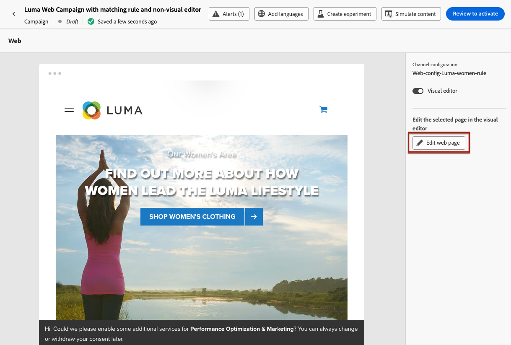

   <!--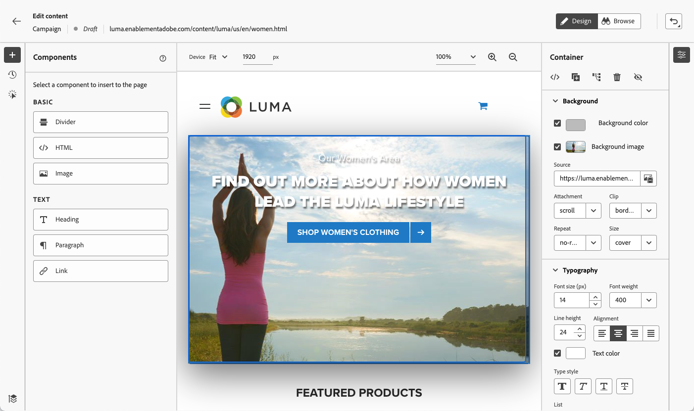-->

   >[!NOTE]
   >
   >如果您嘗試載入無法載入的網站，則會顯示一則訊息，建議您安裝[Visual Editing Helper瀏覽器擴充功能](#install-visual-editing-helper)。 請參閱[本節](web-prerequisites.md#troubleshooting)中疑難排解的一些提示。
   >
   >您也可以在不載入視覺化編輯器的情況下編輯網頁內容。 若要這麼做，請取消選取&#x200B;**[!UICONTROL 視覺化編輯器]**&#x200B;選項，改用非視覺化版本模式。 [了解更多](web-non-visual-editor.md)

1. 在網頁設計工具中選取畫布中的任何元素，例如影像、按鈕、段落、文字、容器、標題、連結等。 [了解更多](#content-components)

1. 若要編輯元素，您可以使用：

   * 上下文選單可編輯其內容、配置、插入連結或個人化等。

     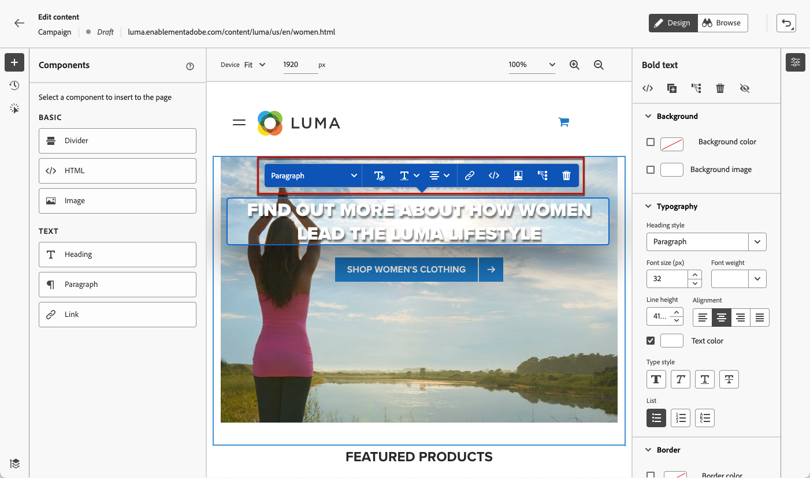

   * 右側面板頂端的圖示可編輯、複製、刪除或隱藏每個元素。

     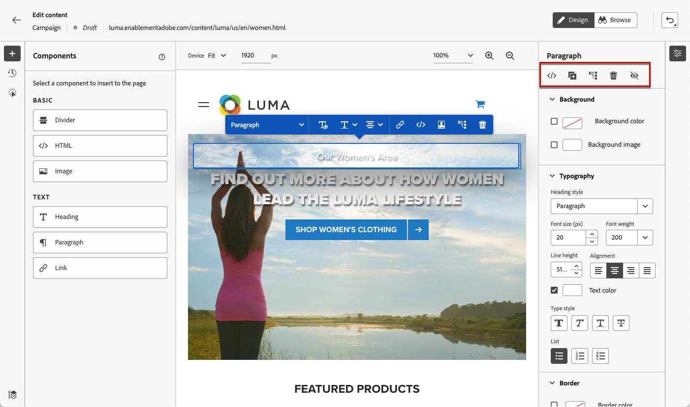

   * 根據所選元素動態變更的右側面板。 例如，您可以編輯元素的背景、印刷樣式、框線、大小、位置、間距、效果或內嵌樣式。

     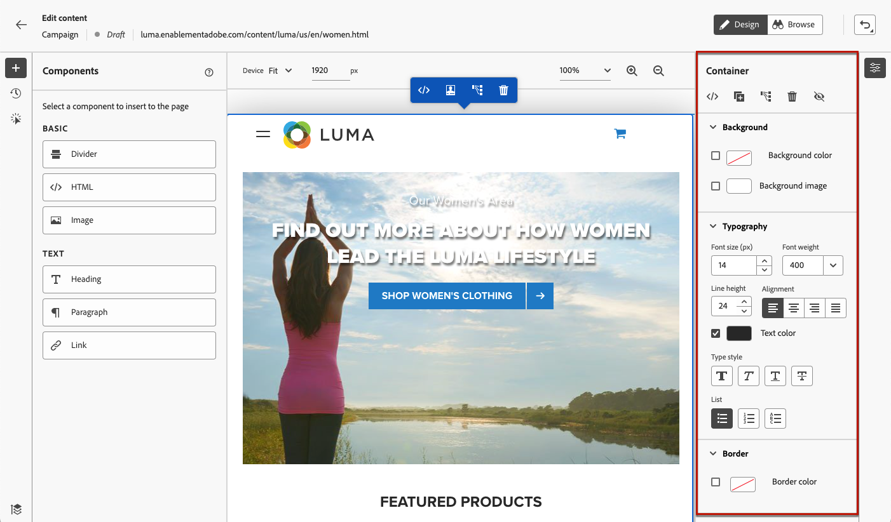

>[!NOTE]
>
>網頁內容設計工具大多與電子郵件Designer類似。 深入瞭解[使用 [!DNL Journey Optimizer]](../email/get-started-email-design.md)設計內容。

編輯網頁內容後，您就可以管理您的修改。 [了解更多](manage-web-modifications.md)

## 使用元件 {#content-components}

>[!CONTEXTUALHELP]
>id="ajo_web_designer_components"
>title="將元件新增到您的網頁"
>abstract="您可以將許多元件新增到您的網頁並根據需要進行編輯。"

1. 從左側的&#x200B;**[!UICONTROL 元件]**&#x200B;窗格中，選取專案。 您可以將下列元件新增至網頁，並視需要加以編輯：

   * [分隔線](../email/content-components.md#divider)
   * [HTML](../email/content-components.md#HTML)
   * [影像](../email/content-components.md#image)
   * 標題 — 使用此元件類似於在電子郵件Designer中使用&#x200B;**[!UICONTROL Text]**&#x200B;元件。 [了解更多](../email/content-components.md#text)
   * 段落 — 使用此元件類似於在電子郵件Designer中使用&#x200B;**[!UICONTROL 文字]**&#x200B;元件。 [了解更多](../email/content-components.md#text)
   * 連結

   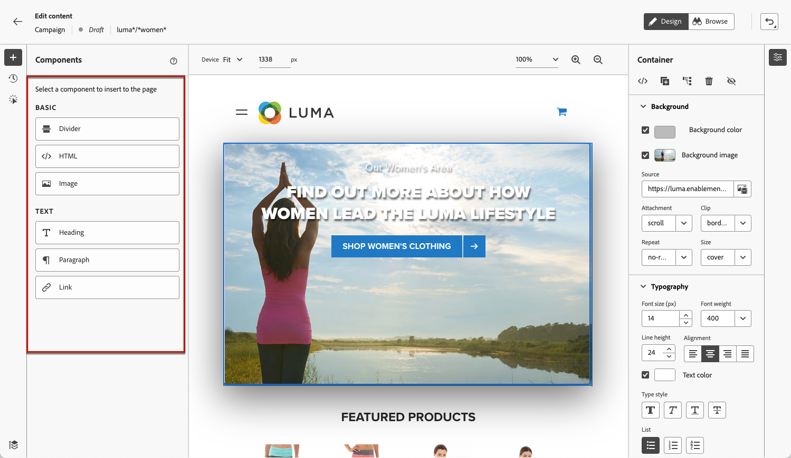

1. 將游標停留在頁面上，然後按一下&#x200B;**[!UICONTROL 插入在前]**&#x200B;或&#x200B;**[!UICONTROL 插入在後]**&#x200B;按鈕，將元件附加至頁面上的現有元素。

   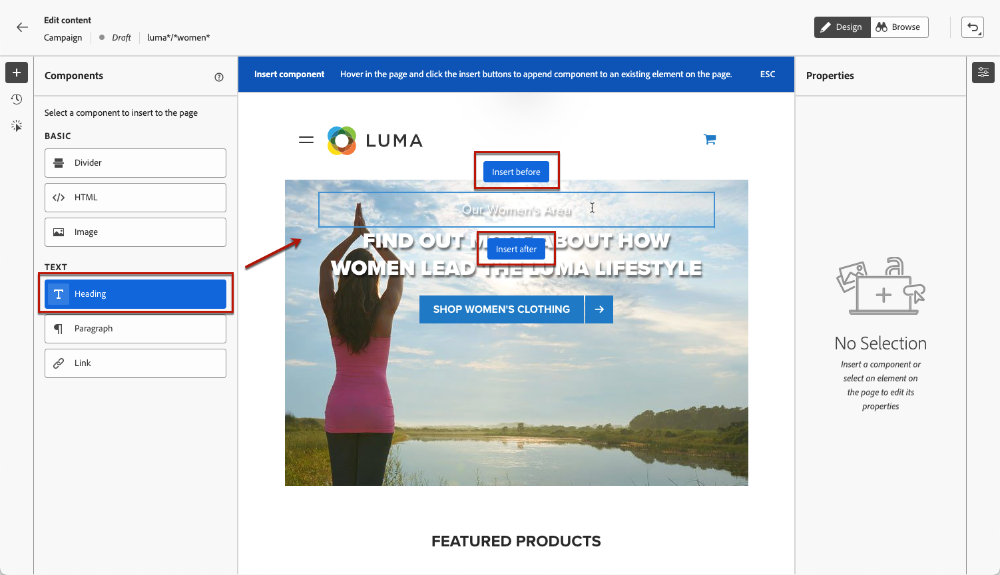

   >[!NOTE]
   >
   >若要取消選取元件，請按一下畫布頂端所顯示內容藍色橫幅中的&#x200B;**[!UICONTROL ESC]**&#x200B;按鈕。

1. 視需要直接在頁面的內容中編輯元件。

   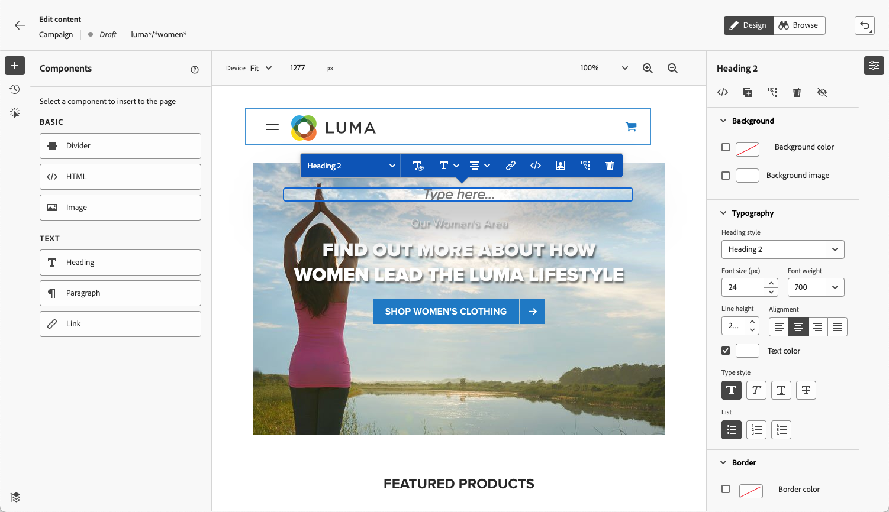

1. 調整從右邊內容窗格顯示的樣式，例如背景、文字顏色、邊框、大小、位置等。  — 視選取的元件而定。

   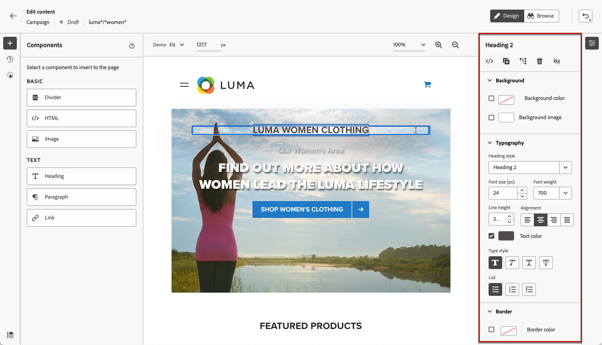

## 新增個人化

若要新增個人化，請選取容器，然後從顯示的內容功能表列中選取個人化圖示。 使用個人化編輯器新增變更。 [了解更多](../personalization/personalization-build-expressions.md)

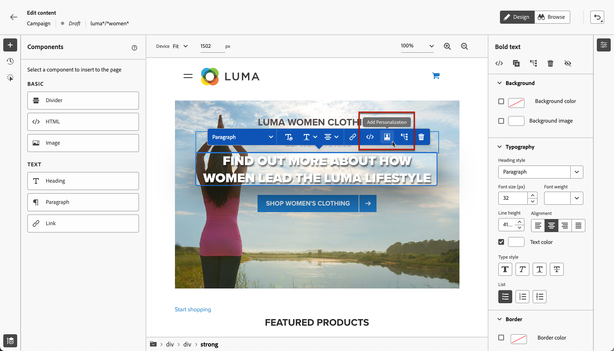

## 瀏覽網頁設計工具 {#navigate-web-designer}

本節詳細說明您可以瀏覽Web設計工具的各種方式。 若要檢視和管理新增至您網頁體驗的修改，請參閱[本節](manage-web-modifications.md)。

### 使用階層連結 {#breadcrumbs}

1. 從畫布中選取任何元素。

1. 按一下畫面左下方的&#x200B;**[!UICONTROL 展開/摺疊階層連結]**&#x200B;按鈕，即可快速顯示所選專案的相關資訊。

   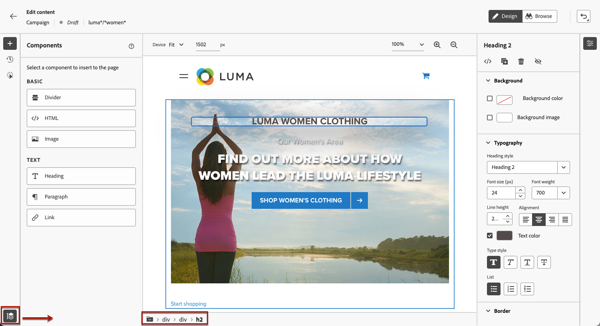

1. 當您將游標停留在階層連結上時，編輯器中會反白顯示對應的元素。

1. 您可以使用它輕鬆導覽至視覺編輯器中的任何父項、同層級專案或子項元素。

### 切換到瀏覽模式 {#browse-mode}

>[!CONTEXTUALHELP]
>id="ajo_web_designer_browse"
>title="使用瀏覽模式"
>abstract="在此模式下，您可以從要個人化的選取設定導覽至確切的頁面。"

您可以使用專用按鈕，將預設&#x200B;**[!UICONTROL 設計]**&#x200B;模式切換至&#x200B;**[!UICONTROL 瀏覽]**&#x200B;模式。

從&#x200B;**[!UICONTROL 瀏覽]**&#x200B;模式中，您可以瀏覽至您想要個人化之所選組態的正確頁面。

在處理經過驗證或無法從特定URL開始使用的頁面時，此外掛程式特別有用。 例如，您將能夠驗證、導覽至您的帳戶頁面或購物車頁面，然後切換回&#x200B;**[!UICONTROL 設計]**&#x200B;模式，以在您想要的頁面上執行變更。

使用&#x200B;**[!UICONTROL 瀏覽]**&#x200B;模式，您也可以在編寫單頁應用程式時，瀏覽您網站的所有檢視。 [了解更多](web-spa.md)

### 變更裝置大小 {#change-device-size}

您可以將網頁設計工具顯示的裝置大小變更為預先定義的大小，例如&#x200B;**[!UICONTROL 平板電腦]**&#x200B;或&#x200B;**[!UICONTROL 行動裝置橫向]**，或輸入所需的畫素數來定義自訂大小。

您也可以將縮放焦點從25%變更為400%。

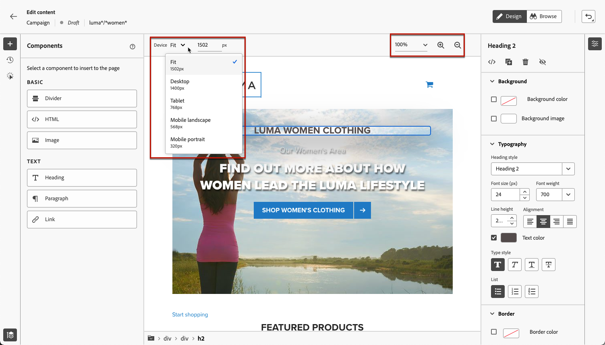

變更裝置大小的功能是專為可適當呈現在各種裝置、視窗和熒幕大小的回應式網站所設計。 回應式網站會自動調整並適應任何熒幕大小，包括桌上型電腦、筆記型電腦、平板電腦或行動電話。

>[!CAUTION]
>
>您可以編輯具有特定裝置大小的網頁體驗。 不過，只要選取器相同，這些變更就會套用至所有大小和裝置，而不只是您正在使用的裝置大小。 同樣地，在標準案頭檢視中編輯體驗時，會將變更套用至所有熒幕大小，而不僅僅是案頭檢視。
>
>目前，[!DNL Journey Optimizer]不支援裝置大小特定的頁面變更。 這表示，舉例來說，如果您有另一個行動網站具有不同的網站結構，您應該針對不同促銷活動中的行動網站進行特定變更。

## 作法影片{#video}

以下影片說明如何在[!DNL Journey Optimizer]行銷活動中使用Web設計工具來撰寫Web體驗。

>[!VIDEO](https://video.tv.adobe.com/v/3418803/?quality=12&learn=on)
