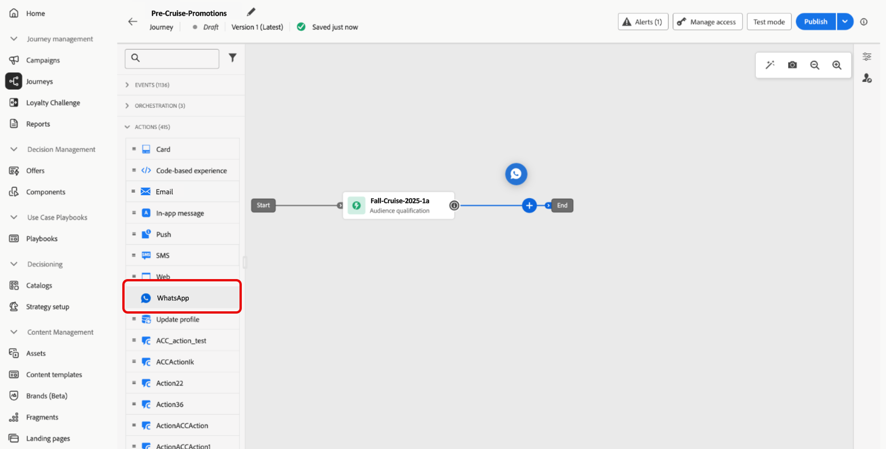

# 建立WhatsApp訊息 {#create-whatsapp}

>[!BEGINSHADEBOX]

**目錄**

* [開始使用WhatsApp訊息](get-started-whatsapp.md)
* [開始使用WhatsApp設定](whatsapp-configuration.md)
* **[建立WhatsApp訊息](create-whatsapp.md)**
* [檢查並傳送您的WhatsApp訊息](send-whatsapp.md)

>[!ENDSHADEBOX]

透過Adobe Journey Optimizer，您可以在WhatsApp上設計和傳送吸引人的訊息。 只需將WhatsApp動作新增至您的歷程或行銷活動，並製作您的訊息內容，如下所述。 Adobe Journey Optimizer也可讓您在傳送WhatsApp訊息之前先行測試，確保完美的呈現、精確的個人化，以及所有設定的正確設定。

>[!VIDEO](https://video.tv.adobe.com/v/3451621?learn=on)

## 新增WhatsApp訊息 {#create-whatsapp-journey-campaign}

瀏覽下列標籤，瞭解如何在行銷活動或歷程中新增WhatsApp訊息。

>[!BEGINTABS]

>[!TAB 將WhatsApp訊息新增至歷程]

1. 開啟您的歷程，然後從浮動視窗的&#x200B;**動作**&#x200B;區段拖放&#x200B;**WhatsApp活動**。

   

1. 提供訊息的基本資訊（標籤、說明、類別），然後選擇要使用的訊息設定。

   如需如何設定歷程的詳細資訊，請參閱[此頁面](../building-journeys/journey-gs.md)

   根據預設，**[!UICONTROL 組態]**&#x200B;欄位會預先填入使用者用於該頻道的最後一個組態。

您現在可以從&#x200B;**[!UICONTROL 編輯內容]**&#x200B;按鈕開始設計WhatsApp訊息的內容，如下所述。

>[!TAB 將WhatsApp訊息新增至行銷活動]

1. 存取&#x200B;**[!UICONTROL 促銷活動]**&#x200B;功能表，然後按一下&#x200B;**[!UICONTROL 建立促銷活動]**。

1. 選取&#x200B;**已排程 — 行銷**&#x200B;行銷活動型別。

1. 從&#x200B;**[!UICONTROL 屬性]**&#x200B;區段，編輯行銷活動的&#x200B;**[!UICONTROL 標題]**&#x200B;和&#x200B;**[!UICONTROL 描述]**。

1. 按一下&#x200B;**[!UICONTROL 選取對象]**&#x200B;按鈕，從可用的Adobe Experience Platform對象清單中定義要定位的對象。 [了解更多](../audience/about-audiences.md)。

1. 在&#x200B;**[!UICONTROL 身分識別名稱空間]**&#x200B;欄位中，選擇要使用的名稱空間，以識別所選對象中的個人。 [了解更多](../event/about-creating.md#select-the-namespace)。

1. 在&#x200B;**[!UICONTROL 動作]**&#x200B;區段中，選擇&#x200B;**[!UICONTROL WhatsApp]**，然後選取或建立新的設定。

   在[此頁面](whatsapp-configuration.md)中進一步瞭解WhatsApp設定。

1. 按一下&#x200B;**[!UICONTROL 建立實驗]**&#x200B;以開始設定您的內容實驗，並建立處理以測量其效能，並為您的目標對象識別最佳選項。 [了解更多](../content-management/content-experiment.md)

1. 在&#x200B;**[!UICONTROL 動作追蹤]**&#x200B;區段中，指定是否要追蹤WhatsApp訊息中連結的點按次數。

1. 行銷活動旨在特定日期或循環頻率執行。 在[本節](../campaigns/create-campaign.md#schedule)中瞭解如何設定行銷活動的&#x200B;**[!UICONTROL 排程]**。

1. 從&#x200B;**[!UICONTROL 動作觸發程式]**&#x200B;功能表，選擇SMS訊息的&#x200B;**[!UICONTROL 頻率]**：

   * 一次
   * 每日
   * 每週
   * 月

您現在可以從&#x200B;**[!UICONTROL 編輯內容]**&#x200B;按鈕開始設計WhatsApp訊息的內容，如下所述。

>[!ENDTABS]

## 定義您的WhatsApp內容{#whatsapp-content}

>[!IMPORTANT]
>
>在Journey Optimizer中設計WhatsApp訊息之前，您必須先在Meta中建立範本。 [了解更多](https://www.facebook.com/business/help/2055875911147364?id=2129163877102343)

1. 在歷程或行銷活動設定畫面中，按一下&#x200B;**[!UICONTROL 編輯內容]**&#x200B;按鈕，設定WhatsApp訊息內容。

<!--
1. Select **[!UICONTROL Template message]**.
-->

1. 選擇您的&#x200B;**範本類別**：

   * 行銷
   * 公用程式
   * Authentication

   [進一步瞭解範本類別](https://developers.facebook.com/docs/whatsapp/updates-to-pricing/new-template-guidelines/#template-category-guidelines)

1. 從&#x200B;**WhatsApp範本**&#x200B;下拉式清單中，選取您先前在Meta中建立的範本。

   [進一步瞭解如何建立您的Whatsapp範本](https://www.facebook.com/business/help/2055875911147364?id=2129163877102343)

1. 使用個人化編輯器將個人化新增到您的範本。 您可以使用任何屬性，例如設定檔名稱或城市。

   瀏覽下列頁面，進一步瞭解[個人化](../personalization/personalize.md)。

1. 使用&#x200B;**[!UICONTROL 模擬內容]**&#x200B;按鈕來預覽您的WhatsApp訊息內容、縮短的URL和個人化內容。 [了解更多](send-whatsapp.md)

執行測試及驗證內容後，您就可以傳送WhatsApp訊息給對象。 這些步驟在[此頁面](send-whatsapp.md)中有詳細說明

<!--
* **[!UICONTROL Template message]**: Predefined message imported from Meta into Journey Optimizer. These are intended for sending notifications, alerts, or updates to your customers.

* **[!UICONTROL Response message]**: Message created in Journey Optimizer and sent in reply to customer queries or interactions.

>[!BEGINTABS]

>[!TAB Template message]

1. From the journey or campaign configuration screen, click the **[!UICONTROL Edit content]** button to configure the WhatsApp message content.

1. Select **[!UICONTROL Template message]**.

1. Choose your Template category. [Learn more](https://developers.facebook.com/docs/WhatsApp/updates-to-pricing/new-template-guidelines/)

1. From the **WhatsApp template** drop-down, select your previously created template designed in Meta.

1. Use the personalization editor to define content, add personalization and dynamic content. You can use any attribute, such as the profile name or city for example. You can also define conditional rules. Browse to the following pages to learn more about [personalization](../personalization/personalize.md) and [dynamic content](../personalization/get-started-dynamic-content.md) in the personalization editor.

1. Use the **[!UICONTROL Simulate content]** button to preview your WhatsApp message content, shortened URLs, and personalized content. [Learn more](send-whatsapp.md)

Once you have performed your tests and validated the content, you can send your WhatsApp message to your audience. These steps are detailed in [this page](send-whatsapp.md)

>[!TAB Response message]

1. From the journey or campaign configuration screen, click the **[!UICONTROL Edit content]** button to configure the WhatsApp message content.

1. Select **[!UICONTROL Response message]**.

1. Enter your text in the **[!UICONTROL Body]** field.

1. Use the personalization editor to define content, add personalization and dynamic content. You can use any attribute, such as the profile name or city for example. You can also define conditional rules. Browse to the following pages to learn more about [personalization](../personalization/personalize.md) and [dynamic content](../personalization/get-started-dynamic-content.md) in the personalization editor.

1. Use the **[!UICONTROL Simulate content]** button to preview your WhatsApp message content, shortened URLs, and personalized content. [Learn more](send-whatsapp.md)

Once you have performed your tests and validated the content, you can send your WhatsApp message to your audience. These steps are detailed in [this page](send-whatsapp.md)

>[!ENDTABS]
-->
