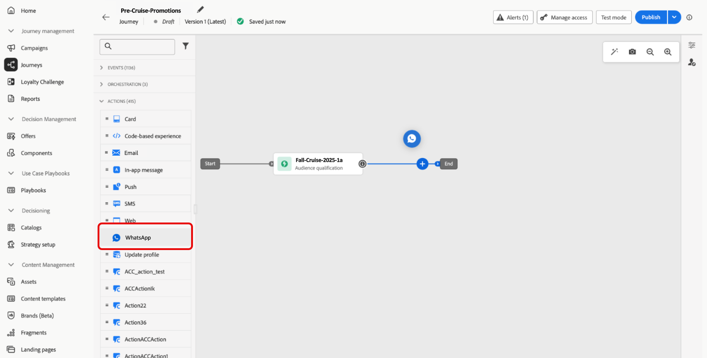
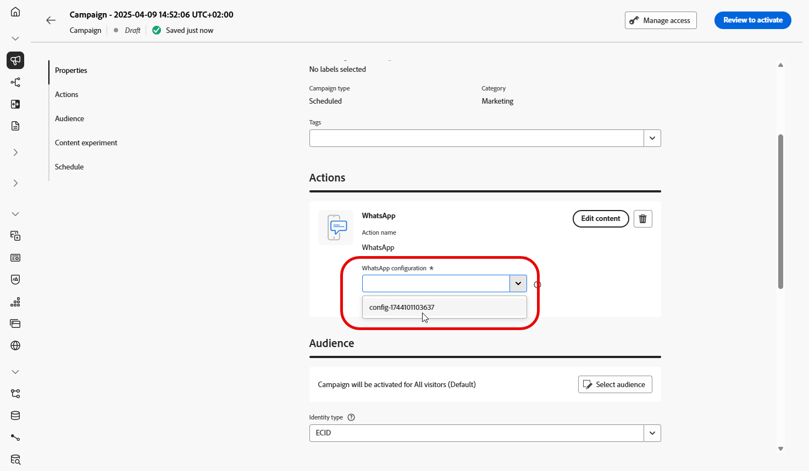
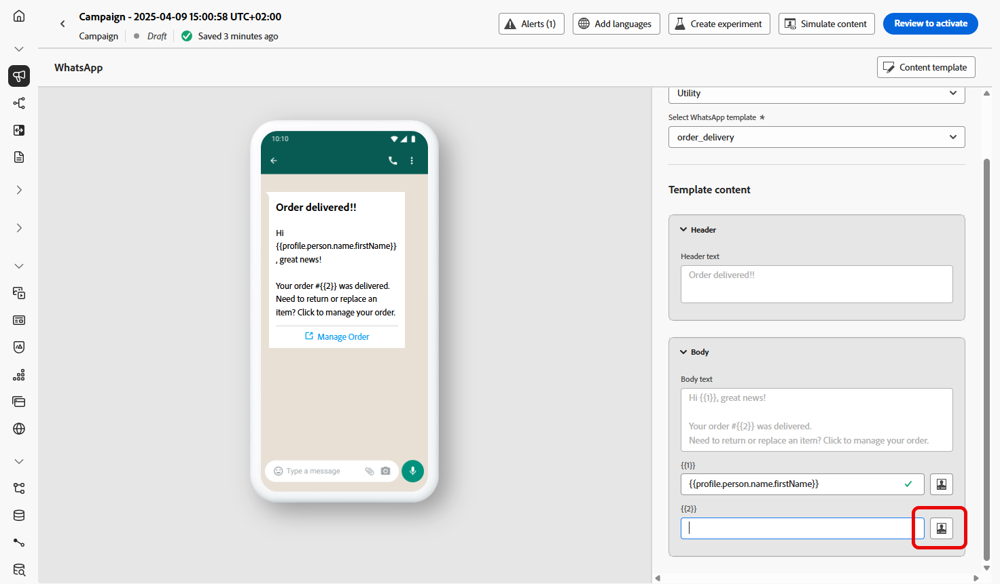
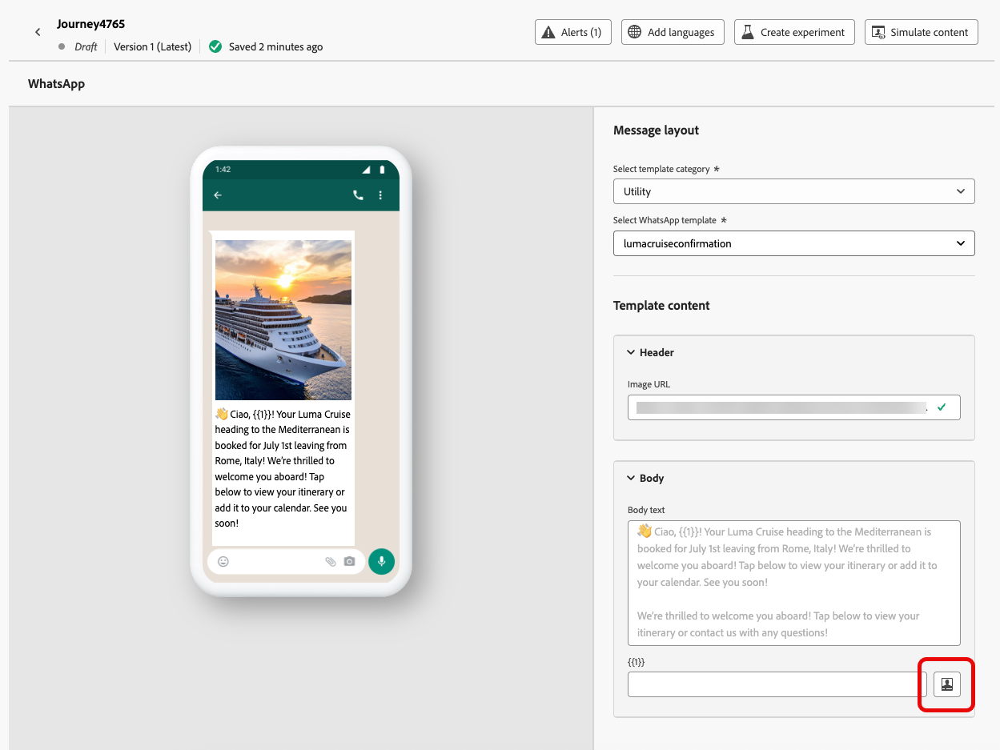

# 建立 WhatsApp 訊息 {#create-whatsapp}

透過Adobe Journey Optimizer，您可以在WhatsApp上設計和傳送吸引人的訊息。 只需將WhatsApp動作新增至您的歷程或行銷活動，並製作您的訊息內容，如下所述。 Adobe Journey Optimizer也可讓您在傳送WhatsApp訊息之前先行測試，確保完美的呈現、精確的個人化，以及所有設定的正確設定。

請注意，Journey Optimizer僅支援傳出訊息元素。

+++ 深入瞭解支援的訊息元素和互動式按鈕

WhatsApp支援下列訊息型別：

| 訊息功能 | 說明 |
|-|-|
| 標頭 | 顯示在訊息本文上方的可選文字。 |
| 文字 | 透過引數支援動態內容。 |
| 影像(JPEG、PNG) | 必須是8位元RGB或RGBA格式，且大小必須小於5 MB。 |
| 影片 | 必須是3GPP或MP4、16 MB以下，並透過URL託管。 |
| 音訊 | 僅適用於回應訊息。 必須是AAC、AMR、MP3、MP4音訊或OGG格式，在URL上託管，且小於16 MB。 |
| 文件 | 必須小於100 MB，在URL上代管，且採用下列其中一種格式： .txt、.xls/.xlsx、.doc/.docx、.ppt/.pptx或.pdf。 |
| 內文 | 透過引數支援動態內容。 |
| 頁尾文字 | 透過引數支援動態內容。 |

以下call-to-action選項適用於您的WhatsApp訊息：

| 行動號召 | 說明 |
|-|-|
| 快速回覆 | 使用者可以點選以回應您的訊息的簡短預設集回覆。 |
| 造訪網站 | 只允許一個按鈕，包含變數引數。 |
| 使用WhatsApp撥打電話 | 提供一個按鈕，可直接從訊息開啟與指定電話號碼的WhatsApp聊天。 |
| 呼叫電話號碼 | 提供當使用者點選時，向指定號碼發起電話通話的按鈕。 |
| CALL TO ACTION - URL | 開啟URL （**造訪網站**）。 只允許一個URL按鈕，包含變數引數。 |
| call to action — 電話 | 使用範本的電話號碼，例如&#x200B;**撥打電話號碼** （撥打電話）或&#x200B;**撥打WhatsApp** （在WhatsApp中開啟與該號碼的聊天）。 |

請注意，不支援&#x200B;**複製代碼**&#x200B;互動按鈕。

+++

## 新增WhatsApp訊息 {#create-whatsapp-journey-campaign}

>[!CONTEXTUALHELP]
>id="ajo_journey_action_whatsapp"
>title="WhatsApp動作"
>abstract="當設定檔達到歷程的這個步驟時，WhatsApp頻道動作會傳送WhatsApp訊息給設定檔。 標籤會識別歷程畫布中的活動，而動作會參照定義所傳送內容的WhatsApp設定。 **最佳化**&#x200B;區段可包含內容實驗或目標定位規則，**多語言**&#x200B;區段可傳送多種語言的內容，而&#x200B;**逾時或錯誤**&#x200B;區段可定義動作失敗時的替代路徑。"
>additional-url="https://experienceleague.adobe.com/zh-hant/docs/journey-optimizer/using/orchestrate-journeys/about-journey-building/journey-action#add-action" text="開始使用頻道動作"

瀏覽下列標籤，瞭解如何在行銷活動或歷程中新增WhatsApp訊息。

>[!BEGINTABS]

>[!TAB 將WhatsApp訊息新增至歷程]

1. 開啟您的歷程，然後從浮動視窗的&#x200B;**動作**&#x200B;區段拖放&#x200B;**WhatsApp活動**。

   

1. 提供訊息的基本資訊（標籤、說明、類別），然後選擇要使用的訊息設定。

   如需如何設定歷程的詳細資訊，請參閱[此頁面](../building-journeys/journey-gs.md)

   根據預設，**[!UICONTROL 組態]**&#x200B;欄位會預先填入使用者用於該頻道的最後一個組態。

1. 在&#x200B;**[!UICONTROL 商業規則]**&#x200B;區段中，您可以套用規則集來控制WhatsApp訊息的通訊壓力。

   深入瞭解[規則集](../conflict-prioritization/rule-sets.md)、[頻道頻率上限](../conflict-prioritization/channel-capping.md)和[無訊息時數](../conflict-prioritization/quiet-hours.md)。

您現在可以從&#x200B;**[!UICONTROL 編輯內容]**&#x200B;按鈕開始設計WhatsApp訊息的內容，如下所述。

>[!TAB 將WhatsApp訊息新增至行銷活動]

1. 存取&#x200B;**[!UICONTROL 促銷活動]**&#x200B;功能表，然後按一下&#x200B;**[!UICONTROL 建立促銷活動]**。

1. 選取&#x200B;**已排程 — 行銷**&#x200B;行銷活動型別。

1. 從&#x200B;**[!UICONTROL 屬性]**&#x200B;區段，編輯行銷活動的&#x200B;**[!UICONTROL 標題]**&#x200B;和&#x200B;**[!UICONTROL 描述]**。

1. 按一下&#x200B;**[!UICONTROL 選取對象]**&#x200B;按鈕，從可用的Adobe Experience Platform對象清單中定義要定位的對象。 [了解更多](../audience/about-audiences.md)。

1. 在&#x200B;**[!UICONTROL 身分識別名稱空間]**&#x200B;欄位中，選擇要使用的名稱空間，以識別所選對象中的個人。 [了解更多](../event/about-creating.md#select-the-namespace)。

1. 在&#x200B;**[!UICONTROL 動作]**&#x200B;區段中，選擇&#x200B;**[!UICONTROL WhatsApp]**，然後選取或建立新的設定。

   在[此頁面](whatsapp-configuration.md)上進一步瞭解WhatsApp設定。

   

1. 按一下&#x200B;**[!UICONTROL 建立實驗]**&#x200B;以開始設定您的內容實驗，並建立處理以測量其效能，並為您的目標對象識別最佳選項。 [了解更多](../content-management/content-experiment.md)

1. 在&#x200B;**[!UICONTROL 動作追蹤]**&#x200B;區段中，指定是否要追蹤WhatsApp訊息中連結的點按次數。

   Journey Optimizer也會追蹤受支援之WhatsApp範本按鈕、**快速回覆**、**Call to action - URL**&#x200B;和&#x200B;**Call to action - phone**&#x200B;上的互動，以及您的其他管道報告。 **不支援複製代碼**&#x200B;按鈕，且不會追蹤其互動。

1. 行銷活動旨在特定日期或循環頻率執行。 在[本節](../campaigns/create-campaign.md#schedule)中瞭解如何設定行銷活動的&#x200B;**[!UICONTROL 排程]**。

1. 從&#x200B;**[!UICONTROL 動作觸發程式]**&#x200B;功能表，選擇WhatsApp訊息的&#x200B;**[!UICONTROL 頻率]**：

   * 一次
   * 每日
   * 每週
   * Month

您現在可以從&#x200B;**[!UICONTROL 編輯內容]**&#x200B;按鈕開始設計WhatsApp訊息的內容，如下所述。

>[!ENDTABS]

## 定義您的WhatsApp內容{#whatsapp-content}

>[!BEGINSHADEBOX]

在Journey Optimizer中設計WhatsApp訊息之前，您必須先在Meta中建立和設計範本。 [了解更多](https://www.facebook.com/business/help/2055875911147364?id=2129163877102343)

請注意，在Journey Optimizer中使用您的WhatsApp範本之前，必須先經過Meta核准。 此程式通常需要幾個小時，但最多可能需要24小時。 [了解更多](https://developers.facebook.com/docs/whatsapp/message-templates/guidelines/#approval-process)

>[!ENDSHADEBOX]

1. 在歷程或行銷活動設定畫面中，按一下&#x200B;**[!UICONTROL 編輯內容]**&#x200B;按鈕，設定WhatsApp訊息內容。

<!--
1. Select **[!UICONTROL Template message]**.
-->

1. 選擇您的&#x200B;**範本類別**：

   * 行銷
   * 公用程式
   * Authentication

   [進一步瞭解範本類別](https://developers.facebook.com/docs/whatsapp/updates-to-pricing/new-template-guidelines/#template-category-guidelines)

   

1. 從&#x200B;**WhatsApp範本**&#x200B;下拉式清單中，選取您先前在Meta中設計的範本。

   [進一步瞭解如何建立Whatsapp範本](https://www.facebook.com/business/help/2055875911147364?id=2129163877102343)

   

1. 在&#x200B;**[!UICONTROL 影像URL]**&#x200B;欄位中，新增媒體URL以取代範本中的任何預留位置。 Meta的範本媒體只是預留位置。 若要正確顯示影像、音訊或視訊，您必須使用來自Adobe Experience Manager或其他來源的外部URL。

   

1. 使用個人化編輯器將個人化新增到您的範本。 您可以使用任何屬性，例如設定檔名稱或城市。

   瀏覽下列頁面，進一步瞭解[個人化](../personalization/personalize.md)。

   

1. 使用&#x200B;**[!UICONTROL 模擬內容]**&#x200B;來預覽您的WhatsApp訊息內容、縮短的URL和個人化內容。 [了解更多](send-whatsapp.md)

執行測試並驗證內容後，您可以[將您的WhatsApp訊息](send-whatsapp.md)傳送給您的對象，並透過[報告](../reports/campaign-global-report-cja.md)監控其效能。 如需儲存在Experience Platform中的WhatsApp互動資料，請參閱[分析WhatsApp互動](send-whatsapp.md#whatsapp-channel-context)。

<!--
* **[!UICONTROL Template message]**: Predefined message imported from Meta into Journey Optimizer. These are intended for sending notifications, alerts, or updates to your customers.

* **[!UICONTROL Response message]**: Message created in Journey Optimizer and sent in reply to customer queries or interactions.

>[!BEGINTABS]

>[!TAB Template message]

1. From the journey or campaign configuration screen, click the **[!UICONTROL Edit content]** button to configure the WhatsApp message content.

1. Select **[!UICONTROL Template message]**.

1. Choose your Template category. [Learn more](https://developers.facebook.com/docs/WhatsApp/updates-to-pricing/new-template-guidelines/)

1. From the **WhatsApp template** drop-down, select your previously created template designed in Meta.

1. Use the personalization editor to define content, add personalization and dynamic content. You can use any attribute, such as the profile name or city for example. You can also define conditional rules. Browse to the following pages to learn more about [personalization](../personalization/personalize.md) and [dynamic content](../personalization/get-started-dynamic-content.md) in the personalization editor.

1. Use **[!UICONTROL Simulate content]** to preview your WhatsApp message content, shortened URLs, and personalized content. [Learn more](send-whatsapp.md)

Once you have performed your tests and validated the content, you can send your WhatsApp message to your audience. These steps are detailed on [this page](send-whatsapp.md)

>[!TAB Response message]

1. From the journey or campaign configuration screen, click the **[!UICONTROL Edit content]** button to configure the WhatsApp message content.

1. Select **[!UICONTROL Response message]**.

1. Enter your text in the **[!UICONTROL Body]** field.

1. Use the personalization editor to define content, add personalization and dynamic content. You can use any attribute, such as the profile name or city for example. You can also define conditional rules. Browse to the following pages to learn more about [personalization](../personalization/personalize.md) and [dynamic content](../personalization/get-started-dynamic-content.md) in the personalization editor.

1. Use **[!UICONTROL Simulate content]** to preview your WhatsApp message content, shortened URLs, and personalized content. [Learn more](send-whatsapp.md)

Once you have performed your tests and validated the content, you can send your WhatsApp message to your audience. These steps are detailed on [this page](send-whatsapp.md)

>[!ENDTABS]
-->

## 作法影片 {#video}

以下影片說明如何使用Adobe Journey Optimizer建立多步驟WhatsApp歷程。

+++ 收看影片

>[!VIDEO](https://video.tv.adobe.com/v/3470293/?captions=chi_hant&learn=on")

+++
