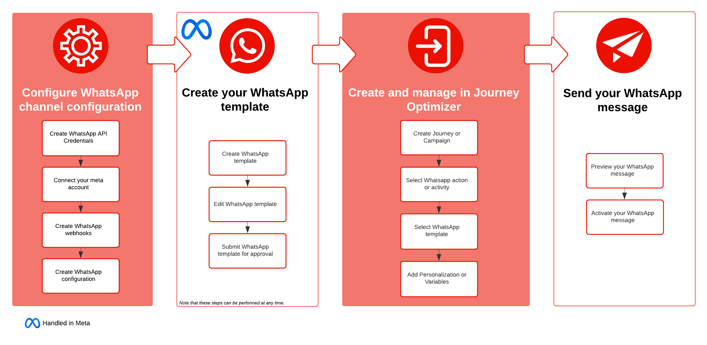

# 開始使用 WhatsApp 訊息 {#get-started-whatsapp}

您目前可以透過 Meta 的[雲端 API](https://developers.facebook.com/docs/whatsapp/cloud-api/)，直接透過 Journey Optimizer 傳送 WhatsApp 訊息。 此功能可將 WhatsApp 緊密整合至歷程和行銷活動，強化和收件者之間的通訊和參與度。

* 在&#x200B;**歷程**&#x200B;中。建立歷程、新增 **WhatsApp** 活動及定義基本設定，然後瀏覽至&#x200B;**[!UICONTROL 動作：WhatsApp]** 右窗格以建立 WhatsApp 訊息的內容。請在[此頁面](../building-journeys/journey-gs.md)進一步了解如何建立歷程。

* 在&#x200B;**行銷活動**&#x200B;中。建立行銷活動，選取 **WhatsApp** 作為您的動作並定義基本設定，然後編輯訊息內容以定義要傳送的 WhatsApp 訊息。請在[此頁面](../campaigns/create-campaign.md#configure)了解如何建立行銷活動。

{zoomable="yes"}

## 先決條件 {#prereq}

將 WhatsApp 與 Journey Optimizer 整合需要下列項目：

* Meta 企業管理員帳戶
* [具有已驗證寄件者名稱與電話號碼的 WhatsApp 企業帳戶](https://developers.facebook.com/docs/whatsapp/overview/business-accounts/)
* [使用者授權權杖擁有適當使用權限](https://developers.facebook.com/blog/post/2022/12/05/auth-tokens/)
* [核准的 Meta 範本](https://developers.facebook.com/docs/whatsapp/message-templates/guidelines/)

在繼續整合之前，您還需要瞭解下列內容：

* [WhatsApp 內容規則](https://www.whatsapp.com/legal/messaging-guidelines)
* [遵守 Meta 原則](https://www.whatsapp.com/legal)
* [24 小時交談限制](https://developers.facebook.com/docs/whatsapp/messaging-limits/)

## 限制 {#limitations}

下列限制適用於 WhatsApp 頻道：

* 已經可以在 Adobe Journey Optimizer 中的 WhatsApp 頻道使用 HIPAA，但第三方還未納入 Adobe 的 BAA。 客戶需自行負責法規遵循及供應商驗證。

* 請注意，尚未支援自動化或是預先定義的回答訊息。

* 自 2025 年 4 月起，會針對擁有美國電話號碼 (由 +1 開始撥號的國碼、美國區域碼組成的號碼) 的 WhatsApp 使用者，暫時暫停傳送所有行銷範本訊息。 [可到 Meta 文件中進一步瞭解](https://developers.facebook.com/docs/whatsapp/cloud-api/guides/send-message-templates#per-user-marketing-template-message-limits)

* 原生整合功能不允許整合入第三方企業服務提供者 (BSP)。

## 作法影片 {#video}

以下影片說明如何將 WhatsApp 整合為 Adobe Journey Optimizer 中的原生頻道，以便大規模提供安全、即時、個人化的訊息。

+++ 收看影片

>[!VIDEO](https://video.tv.adobe.com/v/3470255?captions=chi_hant&learn=on)

+++

## 其他學習資源

探索更多有關WhatsApp訊息和設定的影片教學課程。

➡️ [WhatsApp頻道教學課程](https://experienceleague.adobe.com/zh-hant/docs/journey-optimizer-learn/tutorials/channels/whatsapp/whatsapp-introduction){target="_blank"}

