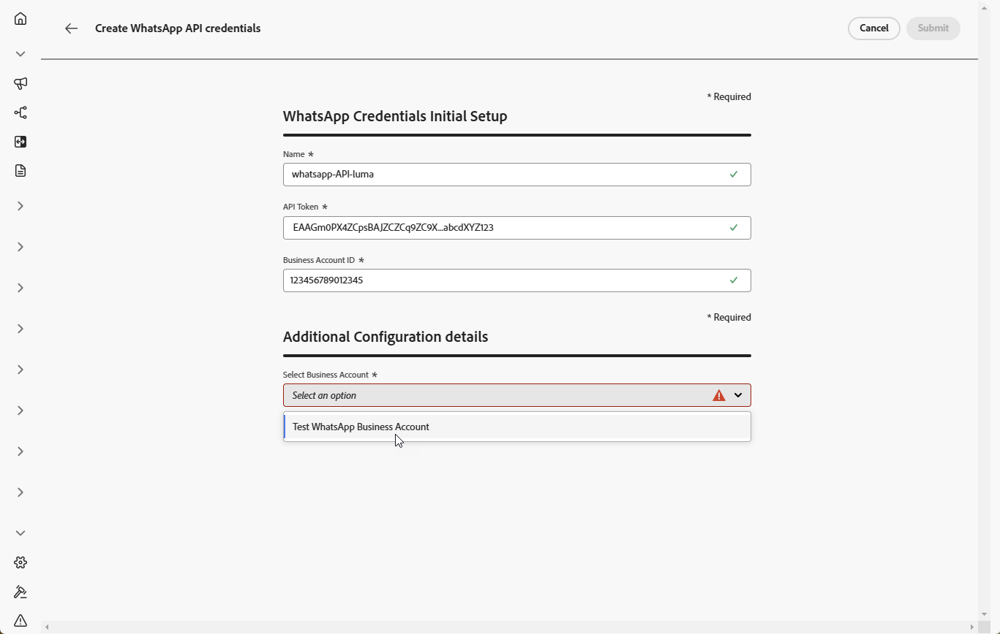
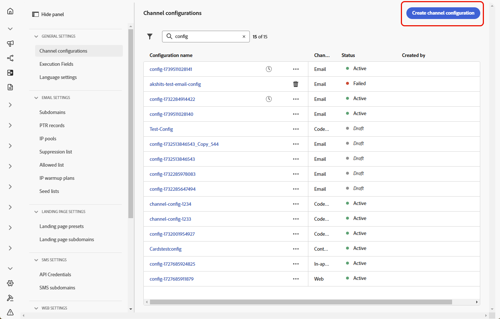
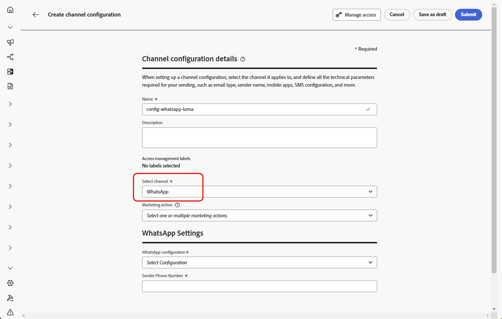
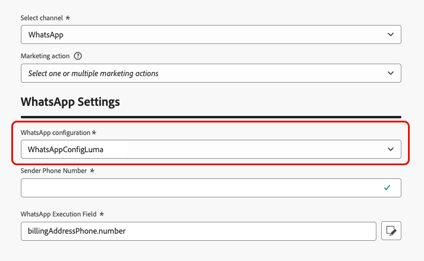

# 開始使用 WhatsApp 設定 {#whatsapp-config}

>[!BEGINSHADEBOX]

**目錄**

* [開始使用 WhatsApp 訊息](get-started-whatsapp.md)
* **[開始使用WhatsApp設定](whatsapp-configuration.md)**
* [建立 WhatsApp 訊息](create-whatsapp.md)
* [檢查並傳送 WhatsApp 訊息](send-whatsapp.md)

>[!ENDSHADEBOX]

在傳送WhatsApp訊息之前，您必須先設定Adobe Journey Optimizer環境，並與您的WhatsApp帳戶建立關聯。 若要執行此動作：

1. [建立您的WhatsApp API認證](#WhatsApp-credentials)
1. [建立您的WhatsApp Webhook](#WhatsApp-webhook)
1. [建立您的WhatsApp設定](#WhatsApp-configuration)

這些步驟必須由Adobe Journey Optimizer [系統管理員](../start/path/administrator.md)執行。

## 建立WhatsApp API認證 {#whatsapp-credentials}

1. 在左側邊欄中，瀏覽至&#x200B;**[!UICONTROL 管理]** `>` **[!UICONTROL 管道]**&#x200B;並選取&#x200B;**[!UICONTROL API認證]**&#x200B;功能表。 按一下&#x200B;**[!UICONTROL 建立新的API認證]**&#x200B;按鈕。

1. 設定您的API認證，如下所述：

   * **API Token**：輸入您的API Token。 進一步瞭解[中繼檔案](https://developers.facebook.com/docs/facebook-login/guides/access-tokens/)
   * **企業帳戶ID**：輸入與您的企業組合相關的唯一編號。 進一步瞭解[中繼檔案](https://www.facebook.com/business/help/1181250022022158?id=180505742745347)。

   

1. 按一下&#x200B;**[!UICONTROL 繼續]**。

1. 選擇您要連線至您的WhatsApp API認證的&#x200B;**商務帳戶**。

   

1. 選取用來傳送您的Whatsapp訊息的&#x200B;**寄件者名稱**。

1. 您的電話號碼設定會自動填寫：

   * **品質評等**：反映客戶對過去24小時內傳送的訊息的意見反應。
      * 綠色：高品質
      * 黃色：Medium品質
      * 紅色：低品質

     深入瞭解[品質評等](https://www.facebook.com/business/help/766346674749731#)

   * **輸送量**：表示您的電話號碼可以傳送訊息的速率。

1. 完成API認證的設定時，請按一下&#x200B;**[!UICONTROL 提交]**。

建立和設定API認證後，您現在需要建立WhatsApp訊息的通道設定。 [了解更多](#whatsapp-configuration)

## 建立Webhook {#WhatsApp-webhook}

>[!CONTEXTUALHELP]
>id="ajo_admin_whatsapp_webhook_inbound_keyword_category"
>title="傳入關鍵字類別"
>abstract="<b>選擇加入</b>：當使用者訂閱時，會傳送您定義的自動回應。  <b>選擇退出</b>：當使用者取消訂閱時，會傳送您定義的自動回應。  <b>說明</b>：當使用者要求說明或支援時，傳送您定義的自動回應。  <b>預設</b>：當沒有相符的關鍵字時，會傳送您的遞補自動回應。"

>[!CONTEXTUALHELP]
>id="ajo_admin_whatsapp_webhook_inbound_keyword"
>title="輸入您的關鍵字"
>abstract="您可以定義關鍵字，以根據使用者文字觸發特定的自動回應。 關鍵字不區分大小寫，例如stop和STOP的處理方式相同。"

>[!CONTEXTUALHELP]
>id="ajo_admin_whatsapp_webhook_webhook_url"
>title="回呼URL"
>abstract="此物件的驗證要求和webhook通知會傳送至指定的URL。"

>[!CONTEXTUALHELP]
>id="ajo_admin_whatsapp_webhook_verify_token"
>title="驗證Token"
>abstract="Meta在驗證程式期間回呼以確認及驗證回呼URL的Token。"

>[!NOTE]
>
>若沒有指定的選擇加入或選擇退出關鍵字，則不會啟用標準同意訊息。

成功建立WhatsApp API認證和[Meta Webhook](https://developers.facebook.com/docs/whatsapp/webhooks/)後，下一步就是建立webhook並設定您的傳入設定。

1. 在左側邊欄中，瀏覽至&#x200B;**[!UICONTROL 管理]** `>` **[!UICONTROL 管道]**，選取&#x200B;**[!UICONTROL WhatsApp設定]**&#x200B;下的&#x200B;**[!UICONTROL WhatsApp Webhooks]**&#x200B;功能表，然後按一下&#x200B;**[!UICONTROL 建立Webhook]**&#x200B;按鈕。

1. 輸入webhook的[!UICONTROL 名稱]。

1. 從下拉式清單中，選取您先前建立的[API認證](#whatsapp-credentials)。

1. 按一下開始設定&#x200B;**[!UICONTROL 傳入關鍵字類別]**，例如：

   * **[!UICONTROL 選擇加入關鍵字]**
   * **[!UICONTROL 選擇退出關鍵字]**
   * **[!UICONTROL 說明關鍵字]**

1. 輸入您的&#x200B;**[!UICONTROL 關鍵字]**。

   若要新增多個關鍵字，請按一下。

1. 指定在收到設定的關鍵字時要傳送的&#x200B;**[!UICONTROL 回複訊息]**。

<!--
1. Click **[!UICONTROL View payload editor]** to validate and customize your request payloads. 
    
    You can dynamically personalize your payload using profile attributes, and ensure accurate data is sent for processing and response generation with the help of built-in helper functions.
-->

1. 完成WhatsApp Webhook的設定時，請按一下&#x200B;**[!UICONTROL 提交]**。

1. 在&#x200B;**[!UICONTROL Webhooks]**&#x200B;功能表中，按一下以刪除您的WhatsApp Webhook。

1. 若要修改現有組態，請找到所需的Webhook，然後按一下&#x200B;**[!UICONTROL 編輯]**&#x200B;選項以進行必要的變更。

1. 從您先前提交的&#x200B;**[!UICONTROL WhatsApp Webhook]**&#x200B;存取及複製新的&#x200B;**[!UICONTROL Webhook URL]**。

現在您的Webhook已設定完畢，您可以建立WhatsApp設定。

## 建立WhatsApp設定 {#whatsapp-configuration}

1. 在左側邊欄中，瀏覽至&#x200B;**[!UICONTROL 管理]** > **[!UICONTROL 管道]**&#x200B;並選取&#x200B;**[!UICONTROL 一般設定]** > **[!UICONTROL 管道設定]**。 按一下&#x200B;**[!UICONTROL 建立通道組態]**&#x200B;按鈕。

   

1. 輸入設定的名稱和說明（選用），然後選取WhatsApp通道。

   >[!NOTE]
   >
   > 名稱必須以字母(A-Z)開頭。 它只能包含英數字元。 您也可以使用底線 `_`、點 `.` 和連字號 `-` 字元。

1. 選取&#x200B;**[!DNL WhatsApp]**&#x200B;作為您的頻道。

   

1. 選取&#x200B;**[!UICONTROL 行銷動作]**，以使用此設定將同意原則與訊息相關聯。 系統會運用與行銷動作相關的所有同意政策，以尊重客戶的偏好設定。 了解更多

1. 選取先前建立的&#x200B;**[!UICONTROL WhatsApp API組態]**。

   

1. 輸入&#x200B;您要用於通訊的&#x200B;**[!UICONTROL 寄件者號碼]**。

1. 設定完所有引數後，按一下&#x200B;**[!UICONTROL 提交]**&#x200B;確認。 您也可以將頻道設定儲存為草稿，並稍後繼續其設定。

1. 建立管道設定後，它就會顯示在狀態為&#x200B;**[!UICONTROL 處理中]**&#x200B;的清單中。

   >[!NOTE]
   >
   >如果檢查不成功，請在[本節](../configuration/channel-surfaces.md)中進一步瞭解可能的失敗原因。

1. 檢查成功後，通道設定會取得&#x200B;**[!UICONTROL 作用中]**&#x200B;狀態。 已準備好用於傳遞訊息。

設定後，您就可以運用所有立即可用的頻道功能，例如訊息製作、個人化、連結追蹤和報告。

您現在可以使用Journey Optimizer傳送WhatsApp訊息。